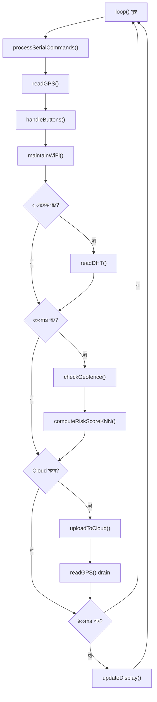
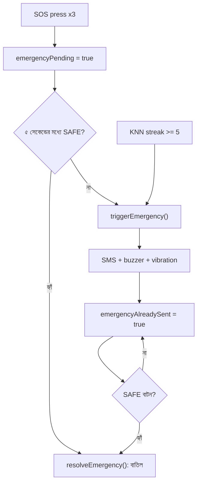
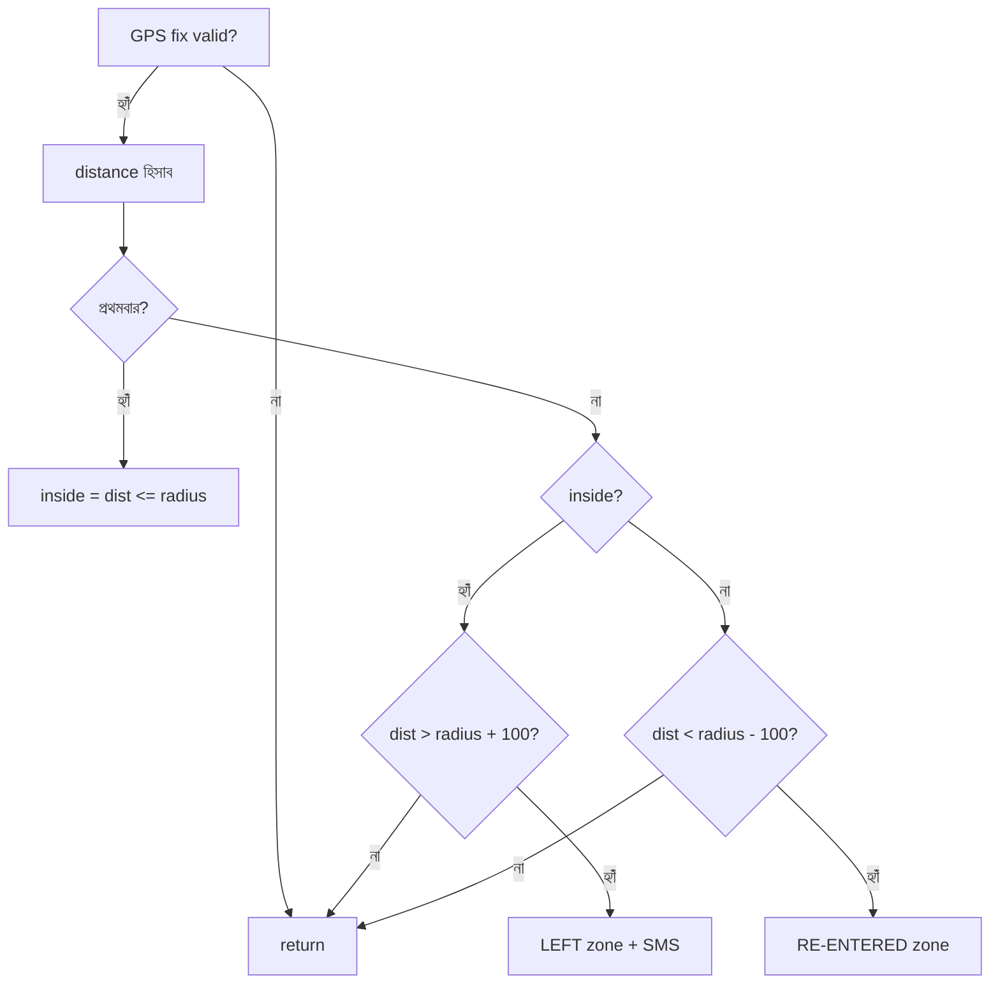
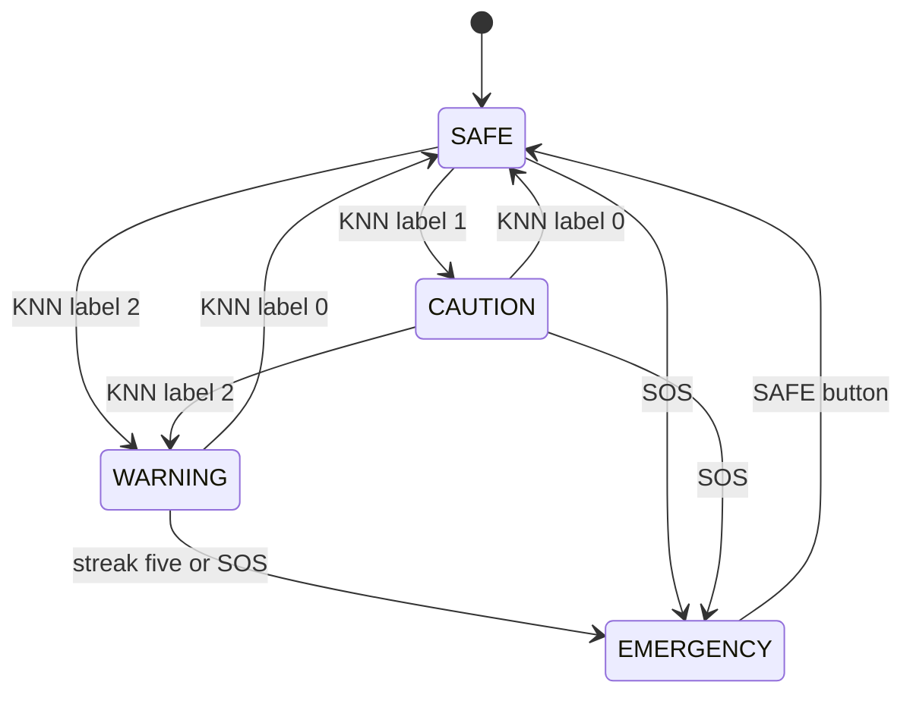
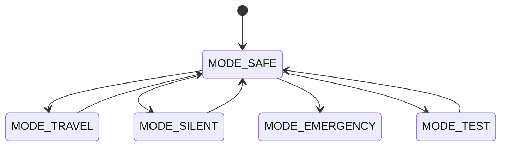
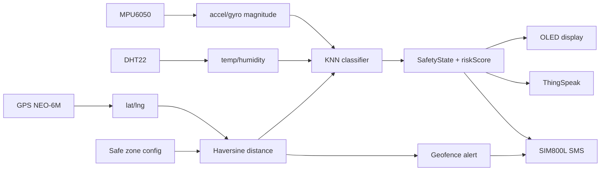
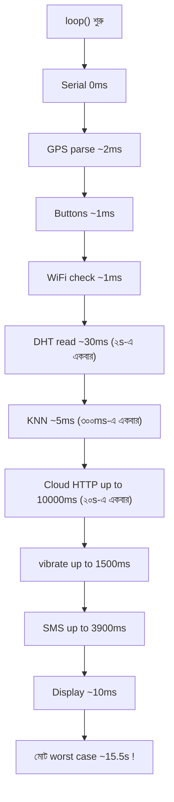

# SafeTrail কোডের লাইন-বাই-লাইন ব্যাখ্যা (বাংলা)

এই ডকুমেন্টে SafeTrail প্রজেক্টের প্রতিটি লাইন কী, কেন ব্যবহার করা হয়েছে, বিকল্প কী কী ছিল, এবং অন্য কোনো পদ্ধতি ভালো হতো কিনা তা ধাপে ধাপে ব্যাখ্যা করা হয়েছে।

---

## ভূমিকা

SafeTrail একটি ESP32 ভিত্তিক ব্যক্তিগত নিরাপত্তা ও জরুরি প্রতিক্রিয়া wearable। এতে আছে:
- MPU6050 (ত্বরণ ও ঘূর্ণন সেন্সর)
- DHT22 (তাপমাত্রা ও আর্দ্রতা)
- GPS (TinyGPS++)
- KNN দিয়ে ঝুঁকি শ্রেণীবিভাগ
- Geofencing (Haversine)
- WiFi + ThingSpeak ক্লাউড
- SIM800L SMS (জরুরি fallback)
- OLED UI, buzzer, vibration motor, ৩টি বাটন
- Serial test console

কোডের ফাইলে ১১৬৭ লাইন আছে। নিচে ক্রম অনুযায়ী প্রতিটি লাইনের ব্যাখ্যা দেওয়া হলো।

---

## ১. হেডার কমেন্ট ও লাইসেন্স/নোট (লাইন 1-72)

### লাইন 1
```cpp
// Note this code will updated over time
```
**কী:** একটি একক-লাইন কমেন্ট, যা জানায় কোডটি ভবিষ্যতে আপডেট হবে।
**কেন:** ডেভেলপার/ব্যবহারকারীকে বোঝানো যে এটি চূড়ান্ত স্থির সংস্করণ নয়।
**বিকল্প:** কমেন্ট না দেওয়া। তবে নোট রাখলে রক্ষণাবেক্ষণ সহজ হয়।
**ভালো হতো?** হ্যাঁ, সাথে ভার্সন নম্বর বা তারিখ থাকলে আরও ভালো হতো (যেমন `// v2 - 2026-01-01`)।

### লাইন 2-3
```cpp

```
**কী:** খালি লাইন (whitespace)।
**কেন:** পড়তে সুবিধার জন্য ব্লক আলাদা করা।
**বিকল্প:** সব একসাথে লিখলে দীর্ঘ ফাইল পড়া কষ্টকর হয়।
**ভালো হতো?** ঠিক আছে, বর্তমান অবস্থাই ভালো।

### লাইন 4-72
```cpp
/*
  =========================================================
  SafeTrail - ...
  ...
*/
```
**কী:** একটি ব্লক কমেন্ট (`/* ... */`) যা পুরো প্রোগ্রামের ডকুমেন্টেশন দেয় — ফিচার তালিকা, wiring summary, প্রয়োজনীয় library, আপলোডের আগে করণীয়, এবং Serial command তালিকা।
**কেন:** নতুন কেউ (বা ভবিষ্যতের আপনি) ফাইল খুলেই বুঝতে পারে হার্ডওয়্যার কীভাবে যুক্ত, কোন লাইব্রেরি লাগবে, আর পরীক্ষা কীভাবে করবে।
**বিকল্প:** আলাদা `README.md` ফাইল। বড় প্রজেক্টে README ভালো, ছোট device প্রজেক্টে কোডের ভেতরে রাখা সুবিধাজনক কারণ কম্পাইলার/এডিটরেই পাওয়া যায়।
**ভালো হতো?** প্রোডাকশন প্রজেক্টে আলাদা README + এখানে সংক্ষিপ্ত নোট ভালো হতো। তবে ব্যবহারিকভাবে এটি কার্যকর।

উপ-অংশগুলো:
- **লাইন 10-20**: ফিচার তালিকা (কী কী সেন্সর ও ক্ষমতা আছে)।
- **লাইন 22-34**: Wiring summary — কোন পিন কোথায় যাবে, voltage সতর্কতা (SIM800L আলাদা 3.7V battery থেকে চালাতে হবে, common GND লাগবে)।
- **লাইন 36-41**: প্রয়োজনীয় library।
- **লাইন 43-52**: আপলোডের আগে WiFi, ThingSpeak key, guardian phone, safe zone সেট করা, এবং training data replaced করা।
- **লাইন 54-71**: Serial console command তালিকা (HELP, STATUS, GPS, ZONE, KNN, SOS, SAFEBTN, THEME, CLOUD, WIFI, RAWACCEL, DHTTEST, MPUTEST, OPMODE)।

**বিকল্প:** `#define` বা `const char*` দিয়ে নোট রাখা যায় না; কমেন্টই এখানে সঠিক পছন্দ।

---

## ২. Library include (লাইন 74-82)

### লাইন 74
```cpp
#include <WiFi.h>
```
**কী:** ESP32 এর WiFi ফাংশনালিটি আনে (connect, status, IP)।
**কেন:** ThingSpeak-এ ডেটা পাঠাতে WiFi লাগে।
**বিকল্প:** WiFiManager library (runtime-এ credential দেওয়ার সুবিধা)। তবে কোডে hardcode করা সহজ সমাধান।
**ভালো হতো?** প্রোডাকশনে WiFiManager ভালো, কারণ SSID/password hardcode না করে captive portal দিয়ে দেওয়া যায়। এখানে hardcode রাখা টেস্টিং-বান্ধব।

### লাইন 75
```cpp
#include <HTTPClient.h>
```
**কী:** HTTP request পাঠানোর ক্লাস (GET/POST)।
**কেন:** ThingSpeak API-তে HTTP GET দিয়ে ডেটা আপলোড করা হয়।
**বিকল্প:** `WiFiClient` দিয়ে ম্যানুয়াল HTTP, অথবা `ThingSpeak.h` অফিসিয়াল library।
**ভালো হতো?** ThingSpeak.h ব্যবহার করলে কোড ছোট ও কম ভুল-prone হতো। তবে HTTPClient বেশি নিয়ন্ত্রণ দেয় (timeout, error)।

### লাইন 76
```cpp
#include <Wire.h>
```
**কী:** I2C communication library (ESP32 Arduino core-এ আসে)।
**কেন:** MPU6050 ও SSD1306 OLED দুটোই I2C-তে (SDA 21, SCL 22) চলে।
**বিকল্প:** কোনো কার্যকর বিকল্প নেই, I2C-র জন্য এটাই standard।

### লাইন 77
```cpp
#include <Adafruit_MPU6050.h>
```
**কী:** MPU6050 accelerometer/gyroscope ড্রাইভার।
**কেন:** raw register পড়ার বদলে সহজে `getEvent()` দিয়ে মান পাওয়া যায়।
**বিকল্প:** raw register নিজে পড়া (দ্রুত কিন্তু জটিল), বা MPU6050 library (কম reputed)।
**ভালো হতো?** Adafruit library রক্ষণাবেক্ষণ ভালো এবং `Adafruit_Sensor` unified interface দেয়, তাই এটাই ভালো।

### লাইন 78
```cpp
#include <Adafruit_Sensor.h>
```
**কী:** Adafruit-এর unified sensor interface (`sensors_event_t`)।
**কেন:** `getEvent()`-এ ব্যবহৃত event struct এখানে define করা।
**বিকল্প:** নিজে struct বানানো, কিন্তু library-র সাথে মানানসই রাখা ভালো।

### লাইন 79
```cpp
#include <Adafruit_GFX.h>
```
**কী:** সব Adafruit display-এর জন্য generic graphics primitive (line, circle, rect, text)।
**কেন:** OLED-এ কাস্টম icon ও UI আঁকতে দরকার।
**বিকল্প:** U8g2 library (আরও শক্তিশালী, বেশি memory ব্যয়)। এখানে GFX সহজ ও হালকা।
**ভালো হতো?** U8g2 ফন্ট-সমৃদ্ধ, কিন্তু এই সহজ UI-র জন্য GFX যথেষ্ট।

### লাইন 80
```cpp
#include <Adafruit_SSD1306.h>
```
**কী:** SSD1306 OLED specific ড্রাইভার।
**কেন:** 128x64 OLED চালানোর জন্য।
**বিকল্প:** U8g2 বা raw I2C command। Adafruit সহজ।

### লাইন 81
```cpp
#include <DHT.h>
```
**কী:** DHT22 sensor ড্রাইভার।
**কেন:** তাপমাত্রা ও আর্দ্রতা পড়তে।
**বিকল্প:** DHTNew, বা নিজে timing প্রোটোকল পড়া (খুব জটিল)। Adafruit DHT standard।
**ভালো হতো?** ঠিক আছে। তবে DHT22 ধীর (২ সেকেন্ড) মাথায় রাখতে হয়।

### লাইন 82
```cpp
#include <TinyGPS++.h>
```
**কী:** NMEA GPS sentence parse করার library।
**কেন:** GPS থেকে latitude/longitude/isValid বের করতে।
**বিকল্প:** `Adafruit_GPS` library। TinyGPS++ হালকা ও নির্ভরযোগ্য।
**ভালো হতো?** TinyGPS++ good choice; এটি non-blocking parse সমর্থন করে।

---

## ৩. WiFi, Cloud, Guardian, Geofence কনফিগ (লাইন 84-99)

### লাইন 84
```cpp
// ---------------- WiFi & Cloud config ----------------
```
**কী:** sectional comment।
**কেন:** কোডের অংশ চিহ্নিত করা।

### লাইন 85
```cpp
const char* WIFI_SSID = "Your wifi name";
```
**কী:** WiFi নেটওয়ার্কের নাম (SSID)। `const char*` pointer।
**কেন:** `WiFi.begin()` এই string চায়।
**বিকল্প:** `String` object, কিন্তু `const char*` কম RAM খরচ করে (String heap fragmentation করে)।
**ভালো হতো?** ঠিক আছে। সিকিউরিটির জন্য credential আলাদা header/`secrets.h`-এ রাখা ভালো, git-এ না রাখা।

### লাইন 86
```cpp
const char* WIFI_PASSWORD = "your password";
```
**কী:** WiFi password।
**কেন:** সংযোগের জন্য।
**বিকল্প:** runtime input / WiFiManager।
**ভালো হতো?** হ্যাঁ — পাসওয়ার্ড সরাসরি কোডে রাখা নিরাপত্তা ঝুঁকি; `secrets.h` ও `.gitignore` ভালো।

### লাইন 87
```cpp
const char* THINGSPEAK_API_KEY = "your private key";
```
**কী:** ThingSpeak channel-এর write API key।
**কেন:** ডেটা আপলোডের সময় authentication-এর জন্য।
**বিকল্প:** কালেক্ট করা থাকলে platform-এর নিজস্ব key নয়, ব্যবহারকারীকেই দিতে হবে (placeholder ভালো)।
**ভালো হতো?** key আলাদা ফাইলে রাখা ও প্রকাশ না করা।

### লাইন 88
```cpp
const char* THINGSPEAK_URL = "http://api.thingspeak.com/update";
```
**কী:** ThingSpeak-এর ডেটা update endpoint।
**কেন:** HTTP GET এখানে পাঠানো হয়।
**বিকল্প:** `https://` (নিরাপদ, কিন্তু ESP32-এ TLS বেশি RAM/সময় নেয়)। এখানে টেস্টের জন্য http রাখা হয়েছে।
**ভালো হতো?** প্রোডাকশনে HTTPS ভালো, ধীর হলেও। তবে ThingSpeak http-ও গ্রহণ করে।

### লাইন 89
```cpp
unsigned long CLOUD_INTERVAL = 20000;  // ThingSpeak free tier needs >=15s; change live with CLOUD <sec>
```
**কী:** ক্লাউড আপলোডের ব্যবধান ২০,০০০ ms = ২০ সেকেন্ড।
**কেন:** ThingSpeak free tier ১৫ সেকেন্ডের কম update হার দিলে ডেটা reject করে।
**বিকল্প:** `#define` দিলে reflash ছাড়া বদলানো যেত না; এখানে `unsigned long` variable রাখা হয়েছে যাতে Serial-এ `CLOUD <sec>` দিয়ে বদলানো যায়।
**ভালো হতো?** ভালো সিদ্ধান্ত — runtime পরিবর্তনযোগ্য রাখা টেস্টিং সহজ করে।

### লাইন 91-92
```cpp
// ---------------- Guardian contact (SMS fallback) ----------------
const char* GUARDIAN_PHONE = "contact number";
```
**কী:** অভিভাবক/guardian-এর ফোন নম্বর, জরুরি SMS পাঠাতে।
**কেন:** WiFi না থাকলেও SMS fallback নিশ্চিত করে।
**বিকল্প:** একাধিক নম্বর array, অথবা runtime-এ সেট করা। এখন একটি।
**ভালো হতো?** একাধিক guardian support ভালো হতো; আন্তর্জাতিক ফরম্যাটে `+880...` নিশ্চিত করা দরকার।

### লাইন 94-96
```cpp
// ---------------- Geofence config ----------------
// Defaults set to your given coordinates. Change live with:
//   ZONE <lat> <lng> <radius_m>
```
**কী:** কনফিগ সেকশনের কমেন্ট, যা বলে safe zone live পরিবর্তন করা যায়।
**কেন:** testing-এ বারবার reflash না করতে।

### লাইন 97
```cpp
double SAFE_ZONE_LAT = ********;
```
**কী:** safe zone-এর কেন্দ্রের latitude (double)।
**কেন:** Haversine distance হিসাব করতে।
**বিকল্প:** `float` — কম নির্ভুল; coordinate-এ double ভালো।
**ভালো হতো?** double সঠিক; মান গোপন রাখা (mask) ঠিক আছে।

### লাইন 98
```cpp
double SAFE_ZONE_LNG = ********;
```
**কী:** safe zone-এর কেন্দ্রের longitude। উপরের মতোই।

### লাইন 99
```cpp
double SAFE_ZONE_RADIUS_M = 300.0;  // meters - tune to taste
```
**কী:** safe zone-এর ব্যাসার্ধ ৩০০ মিটার।
**কেন:** এই ব্যাসার্ধের বাইরে গেলে geofence alert।
**বিকল্প:** `#define`; কিন্তু runtime পরিবর্তনের জন্য variable ভালো।
**ভালো হতো?** variable রাখা ভালো, কারণ `ZONE` command দিয়ে বদলানো হয়।

---

## ৪. Pin ও ধ্রুবক define (লাইন 101-120)

### লাইন 101-102
```cpp
// ---------------- Pin definitions ----------------
#define DHT_PIN 4
```
**কী:** DHT22 ডেটা পিন GPIO4।
**কেন:** `#define` compile-time constant, RAM খরচ করে না।
**বিকল্প:** `const int` — type-safe কিন্তু RAM নেয়। pin-এর জন্য `#define` প্রচলিত।

### লাইন 103
```cpp
#define THEME_BUTTON 25   // was MODE_BUTTON - now cycles OLED theme
```
**কী:** theme পরিবর্তনের বাটন GPIO25।
**কেন:** কমেন্টে ইতিহাস — আগে MODE_BUTTON ছিল, এখন theme cycle করে।
**বিকল্প:** আলাদা mode button রাখা। এখন এক বাটনে theme।

### লাইন 104
```cpp
#define SAFE_BUTTON 33
```
**কী:** "I'M SAFE" বাটন GPIO33, যা emergency বাতিল করে।

### লাইন 105
```cpp
#define SOS_BUTTON 32
```
**কী:** SOS বাটন GPIO32, ৩ বার চাপলে emergency arm হয়।

### লাইন 106
```cpp
#define BUZZER_PIN 27
```
**কী:** buzzer পিন GPIO27; passive buzzer তাই `tone()` ব্যবহার।

### লাইন 107
```cpp
#define VIBRATION_PIN 26
```
**কী:** vibration motor নিয়ন্ত্রণ পিন GPIO26 (transistor base-এ 200Ω দিয়ে)।

### লাইন 109-112
```cpp
#define SIM_RX 13
#define SIM_TX 14
#define GPS_RX 16
#define GPS_TX 17
```
**কী:** SIM800L ও GPS-এর UART RX/TX পিন।
**কেন:** ESP32-এ GPS = UART2 (16/17), SIM800L = UART1 (13/14)।
**বিকল্প:** SoftwareSerial — ESP32-এ unreliable; hardware serial ভালো।
**ভালো হতো?** hardware UART ব্যবহার সঠিক পছন্দ।

### লাইন 114-115
```cpp
#define SCREEN_WIDTH 128
#define SCREEN_HEIGHT 64
```
**কী:** OLED রেজোলিউশন 128x64।
**কেন:** display object ও আঁকিবুঁকিতে ব্যবহৃত।

### লাইন 116
```cpp
#define OLED_ADDR 0x3C
```
**কী:** OLED-এর I2C ঠিকানা 0x3C।
**কেন:** `display.begin()`-এ দরকার।
**বিকল্প:** 0x3D-ও সম্ভব (কিছু মডিউলে)। স্ক্যান করে নিশ্চিত করা ভালো।

### লাইন 117
```cpp
#define DHTTYPE DHT22
```
**কী:** sensor টাইপ DHT22।
**কেন:** `dht(DHT_PIN, DHTTYPE)`-এ ব্যবহৃত।

### লাইন 119-120
```cpp
int emergencyStreak = 0;
const int EMERGENCY_CONFIRM_COUNT = 5;
```
**কী:** পরপর কতবার KNN EMERGENCY বললে নিশ্চিত ধরা হবে তার counter ও threshold (৫)।
**কেন:** একবার ভুল pixel/ঝাঁকুনিতে emergency এড়াতে streak লাগে।
**বিকল্প:** fixed threshold-এর বদলে rolling average বা time-based। streak সহজ ও কার্যকর।
**ভালো হতো?** ৫ = ৫ x ৩০০ms ≈ ১.৫ সেকেন্ড, যা fall impact ধরতে যথেষ্ট; যুক্তিসঙ্গত।

---

## ৫. Object তৈরি (লাইন 122-128)

### লাইন 122-123
```cpp
// ---------------- Objects ----------------
Adafruit_MPU6050 mpu;
```
**কী:** MPU6050 driver object (global)।
**কেন:** setup ও loop-এ সবখানে দরকার, তাই global।
**বিকল্প:** local object — তবে প্রতিবার নতুন করে init করতে হতো।

### লাইন 124
```cpp
Adafruit_SSD1306 display(SCREEN_WIDTH, SCREEN_HEIGHT, &Wire, -1);
```
**কী:** OLED object। প্যারামিটার: প্রস্থ, উচ্চতা, I2C bus reference, এবং reset pin = -1 (reset পিন নেই, share করা)।
**কেন:** -1 মানে ESP32 reset দরকার নেই।
**বিকল্প:** reset পিন আলাদা দিলে দেখা যেত খাটানো; কিন্তু সাধারণ মডিউলে -1 কাজ করে।

### লাইন 125
```cpp
DHT dht(DHT_PIN, DHTTYPE);
```
**কী:** DHT sensor object।

### লাইন 126
```cpp
TinyGPSPlus gps;
```
**কী:** GPS parser object।

### লাইন 127
```cpp
HardwareSerial gpsSerial(2);
```
**কী:** UART2 (hardware) GPS-এর জন্য।
**কেন:** ESP32-এ ৩টি hardware UART আছে; UART0 debug Serial, তাই GPS = UART2।
**বিকল্প:** SoftwareSerial — খারাপ নির্ভরযোগ্যতা।

### লাইন 128
```cpp
HardwareSerial simSerial(1);
```
**কী:** UART1 SIM800L-এর জন্য। UART1 default-এ flash পিনে যুক্ত থাকতে পারে, কারণ pin remap করে 13/14 দেওয়া হয়েছে।

---

## ৬. State enum ও global ভেরিয়েবল (লাইন 130-183)

### লাইন 130
```cpp
// ---------------- System state ----------------
```

### লাইন 131-134
```cpp
enum SafetyState {
  SAFE,
  CAUTION,
  WARNING,
  EMERGENCY
};
```
**কী:** চারটি safety state-এর enum (0,1,2,3)।
**কেন:** KNN label গুলো 0-3; enum কোড পড়তে সহজ করে, magic number এড়ায়।
**বিকল্প:** `#define` বা plain int। enum type-safe, তাই ভালো।
**ভালো হতো?** হ্যাঁ, KNN label-এর সাথে মান মিলিয়ে রাখা চমৎকার (label i = state i)।

### লাইন 135-139
```cpp
enum OperatingMode {
  MODE_SAFE,
  MODE_TRAVEL,
  MODE_SILENT,
  MODE_EMERGENCY,
  MODE_TEST
};
```
**কী:** অপারেটিং মোড (SAFE, TRAVEL, SILENT, EMERGENCY, TEST)।
**কেন:** বর্তমানে শুধু SILENT আসলে ব্যবহার হয় (buzzer বন্ধ রেখে শুধু vibration)। বাকিগুলো ভবিষ্যতের জন্য প্রস্তুত।
**বিকল্প:** শুধু একটি `silentMode` bool — কিন্তু enum extensible।
**ভালো হতো?** বেশিরভাগ mode এখন inert; দরকার না হলে সরানো যেত, কিন্তু ভবিষ্যতের জন্য রাখা ঠিক।

### লাইন 141
```cpp
SafetyState currentState = SAFE;
```
**কী:** বর্তমান safety state, শুরুতে SAFE।

### লাইন 142
```cpp
OperatingMode currentMode = MODE_SAFE;  // now set via Serial: OPMODE <...>
```
**কী:** বর্তমান operating mode, শুরুতে SAFE। Serial `OPMODE` দিয়ে বদলানো যায়।

### লাইন 143
```cpp
int riskScore = 0;
```
**কী:** ঝুঁকির স্কোর 0-99, UI-তে % হিসেবে দেখানো হয় (predictedLabel * 33)।

### লাইন 144
```cpp
int displayTheme = 0;  // 0=Standard 1=Cat 2=DataView - cycled by THEME button / THEME command
```
**কী:** OLED theme index (0,1,2), button/command দিয়ে cycle।

### লাইন 146
```cpp
bool emergencyPending = false;
```
**কী:** SOS চাপার পর ৫ সেকেন্ডের cancel window চলছে কিনা।

### লাইন 147
```cpp
unsigned long emergencyPendingStart = 0;
```
**কী:** emergencyPending শুরু হওয়ার সময় (millis)।

### লাইন 148
```cpp
const unsigned long CANCEL_WINDOW_MS = 5000;
```
**কী:** cancel window ৫০০০ms। এই সময়ের মধ্যে SAFE না চাপলে emergency পাঠানো হয়।
**বিকল্প:** ১০ সেকেন্ড — কিন্তু বিলম্ব বেড়ে যায়; ৫s যুক্তিসঙ্গত।

### লাইন 149
```cpp
bool emergencyAlreadySent = false;
```
**কী:** emergency alert ইতিমধ্যে পাঠানো হয়েছে কিনা, duplicate ঠেকায়।

### লাইন 150
```cpp
bool geofenceAlertSent = false;
```
**কী:** zone ছাড়ার alert পাঠানো হয়েছে কিনা; re-enter করলে reset হয়।

### লাইন 152
```cpp
int sosPressCount = 0;
```
**কী:** চলতি window-তে SOS কতবার চাপা হয়েছে।

### লাইন 153
```cpp
unsigned long lastSosPressTime = 0;
```
**কী:** শেষ SOS চাপার সময়।

### লাইন 154
```cpp
const unsigned long SOS_PRESS_WINDOW_MS = 2000;
```
**কী:** ৩টি press ২ সেকেন্ডের মধ্যে হতে হবে।

### লাইন 156-158
```cpp
unsigned long lastThemeDebounce = 0;
unsigned long lastSafeDebounce = 0;
unsigned long lastSosDebounce = 0;
```
**কী:** প্রতি বাটনের শেষ গ্রহণযোগ্য চাপের সময়, debounce-এর জন্য।

### লাইন 159
```cpp
const unsigned long DEBOUNCE_MS = 30;
```
**কী:** ৩০ms debounce — যান্ত্রিক বাউন্স উপেক্ষা।
**বিকল্প:** 50ms আরও নিরাপদ, কিন্তু 30ms যথেষ্ট।

### লাইন 161-165
```cpp
// Edge-detection state for buttons (fix: ...)
bool lastThemeBtnState = LOW;
bool lastSafeBtnState = LOW;
bool lastSosBtnState = LOW;
```
**কী:** প্রতিটি বাটনের আগের অবস্থা, rising-edge detect করার জন্য।
**কেন:** কমেন্ট ব্যাখ্যা করে আগে bug ছিল — চেপে ধরলে প্রতি loop-এ fire করত, ফলে একটি চাপকে অনেক চাপ মনে হতো।
**বিকল্প:** library (Bounce2) ব্যবহার। তবে নিজে edge detect হালকা ও স্পষ্ট।
**ভালো হতো?** Bounce2 আরও পরিষ্কার হতো, কিন্তু manual সমাধান নির্ভরযোগ্য।

### লাইন 167
```cpp
float temperature = 0, humidity = 0;
```
**কী:** সেন্সর থেকে পড়া তাপমাত্রা ও আর্দ্রতা।

### লাইন 168
```cpp
float lastLat = 0, lastLng = 0;
```
**কী:** সর্বশেষ বৈধ GPS অক্ষাংশ/দ্রাঘিমাংশ।

### লাইন 169
```cpp
bool gpsFixValid = false;
```
**কী:** GPS fix বৈধ কিনা।

### লাইন 170
```cpp
bool wifiConnected = false;
```
**কী:** WiFi সংযুক্ত কিনা (maintainWiFi আপডেট করে)।

### লাইন 171
```cpp
bool insideSafeZone = true;
```
**কী:** ব্যবহারকারী safe zone-এর ভিতরে কিনা।

### লাইন 172
```cpp
bool zoneStateInitialized = false;
```
**কী:** geofence-এর inside/outside অবস্থা প্রথমবার নির্ধারিত হয়েছে কিনা; প্রথম fix-এ alert এড়ায়।

### লাইন 173
```cpp
double distanceFromSafeZone = 0;  // meters
```
**কী:** safe zone কেন্দ্র থেকে দূরত্ব (মিটার)।

### লাইন 175-177
```cpp
// Geofence hysteresis prevents GPS jitter near the boundary
const double ZONE_EXIT_MARGIN_M = 100.0;
const double ZONE_ENTER_MARGIN_M = 100.0;
```
**কী:** hysteresis margin ১০০m। বাইরে যেতে radius+100m, ভিতরে ফিরতে radius-100m লাগে।
**কেন:** boundary-র কাছে GPS ঝাঁকুনিতে বারবার alert/clear হবে না।
**বিকল্প:** margin ছাড়া সরাসরি তুলনা — noisy। hysteresis সঠিক engineering।
**ভালো হতো?** হ্যাঁ; ভিন্ন exit/enter margin দিয়ে আরও টিউন করা যায়।

### লাইন 179-183
```cpp
unsigned long lastDisplayUpdate = 0;
unsigned long lastDhtRead = 0;
unsigned long lastRiskUpdate = 0;
unsigned long lastCloudUpload = 0;
unsigned long lastWiFiRetry = 0;
```
**কী:** বিভিন্ন periodic কাজের শেষ সময় timestamps — non-blocking timing-এর জন্য।
**কেন:** `delay()` এড়িয়ে loop সচল রাখা (multitasking ভাব)।
**বিকল্প:** `millis()`-ভিত্তিক এই pattern-ই best practice; `delay()` ব্যবহার করলে button/GPS response আটকে যেত।

---

## ৭. KNN Risk Classifier (লাইন 185-364)

### লাইন 185-188
```cpp
// =========================================================
//  KNN RISK CLASSIFIER
// =========================================================
// Features: {accelMagnitude, gyroMagnitude, temperature, humidity, distanceFromSafeZone}
// Labels: 0=SAFE, 1=CAUTION, 2=WARNING, 3=EMERGENCY
```
**কী:** KNN অংশের হেডিং ও feature/label-এর ব্যাখ্যা।
**কেন:** ৫টি feature ও ৪টি class স্পষ্ট করা।
**বিকল্প:** neural network বা decision tree — কিন্তু ESP32-এ KNN হালকা ও ব্যাখ্যাযোগ্য (explainable)।
**ভালো হতো?** ছোট ডেটাসেটে KNN ঠিক; বড় ডেটায় feature scaling + অন্য model ভালো।

### লাইন 191-192
```cpp
// IMPORTANT: this is placeholder training data. Replace with your
// own collected + labeled readings for real accuracy.
```
**কী:** প্লেসহোল্ডার training data-র সতর্কতা।
**কেন:** বাস্তব নির্ভুলতার জন্য নিজের ডেটা লাগবে।

### লাইন 194-196
```cpp
#define NUM_SAMPLES 25
#define NUM_FEATURES 5
#define K 5
```
**কী:** মোট sample ২৫, feature ৫, K = ৫ (৫টি নিকটতম প্রতিবেশী)।
**কেন:** `#define` compile-time, দ্রুত ও memory-সাশ্রয়ী।
**বিকল্প:** `const int` — type-safe কিন্তু array size-এ `#define`/constexpr দরকার।
**ভালো হতো?** K=5, ২৫ sample-এ যুক্তিসঙ্গত; তবে ২৫ sample খুবই কম — বাস্তবে শত শত লাগে।

### লাইন 198
```cpp
const float featureMin[NUM_FEATURES] = { 0, 0, 0, 0, 0 };
```
**কী:** প্রতি feature-এর সর্বনিম্ন মান (normalization-এর জন্য)।
**কেন:** min-max scaling। সব ০ ধরা হয়েছে।
**বিকল্প:** Z-score normalization, অথবা dynamic min/max। স্থির min-max সরল ও embedded-বান্ধব।

### লাইন 199
```cpp
const float featureMax[NUM_FEATURES] = { 30, 10, 50, 100, 500 };
```
**কী:** accel 30, gyro 10, temp 50, hum 100, dist 500 — প্রতি feature-এর সর্বোচ্চ মান।
**কেন:** 0-1 রেঞ্জে আনতে।
**বিকল্প:** প্রতিটি feature-এর observed max ব্যবহার। এখানে domain knowledge থেকে বসানো।
**ভালো হতো?** ট্রেনিং ডেটা থেকে auto max বের করা আরও নির্ভুল, কিন্তু সমস্যা হলে manual নিরাপদ।

### লাইন 201-232
```cpp
const float trainData[NUM_SAMPLES][NUM_FEATURES] = {
  // --- SAFE (resting / normal walking, inside safe zone) ---
  { 9.8, 0.1, 28.0, 60, 20 },
  ...
};
```
**কী:** ২৫টি labeled training sample-এর 2D array। প্রতিটি সারিতে ৫টি feature। মন্তব্যে ৪টি শ্রেণী ভাগ করা:
- লাইন 203-207: SAFE (বিশ্রাম/স্বাভাবিক হাঁটা, zone-এর ভিতরে) — accel ≈9.8, gyro ≈0.1, dist ছোট।
- লাইন 209-213: CAUTION (দ্রুত নড়াচড়া, zone প্রান্তে) — accel ≈13-15, gyro ≈1, dist 150-190।
- লাইন 215-219: WARNING (হঠাৎ নড়াচড়া, zone-এর বাইরে) — accel ≈19-21, gyro ≈2, dist 300-400।
- লাইন 221-225: EMERGENCY (fall impact, zone থেকে দূরে) — accel ≈26-29, gyro ≈3.5-4.2, dist 450-490।
- লাইন 227-231: EMERGENCY (zone-এর ভিতরেও fall, যেমন বাড়িতে) — accel বেশি কিন্তু dist ছোট।
**কেন:** শেষ গ্রুপটি গুরুত্বপূর্ণ — শুধু distance বিবেচনা করলে বাড়ির ভেতরের পড়ে যাওয়া মিস হতো; তাই pattern শেখানো হয়েছে।
**বিকল্প:** বাস্তব ডেটা দেওয়া সবচেয়ে ভালো। Synthetic ডেটা শিক্ষামূলক demo।
**ভালো হতো?** অবশ্যই — নিজের sensor দিয়ে collect করে label করা বাধ্যতামূলক প্রকৃত নির্ভুলতার জন্য।

### লাইন 234-240
```cpp
const int trainLabels[NUM_SAMPLES] = {
  0, 0, 0, 0, 0,
  1, 1, 1, 1, 1,
  2, 2, 2, 2, 2,
  3, 3, 3, 3, 3,
  3, 3, 3, 3, 3
};
```
**কী:** প্রতি training sample-এর label। প্রথম ৫টি SAFE(0), এরপর ৫ CAUTION(1), ৫ WARNING(2), শেষ ১০ EMERGENCY(3)।
**কেন:** supervised classification-এর জন্য label লাগে।
**বিকল্প:** struct-এ data+label একসাথে রাখা (graph-বান্ধব)। আলাদা array সহজ।
**ভালো হতো?** struct পদ্ধতি ভুল মেলানো (index mismatch) রোধ করত; তবে স্থির ২৫ sample-এ ঝুঁকি কম।

### লাইন 242-249
```cpp
float normalize(float value, int featureIdx) {
  float range = featureMax[featureIdx] - featureMin[featureIdx];
  if (range == 0) return 0;
  float v = (value - featureMin[featureIdx]) / range;
  if (v < 0) v = 0;
  if (v > 1) v = 1;
  return v;
}
```
**কী:** min-max normalization function — মানকে 0-1-এ আনে।
**লাইন 243:** range বের করা (max-min)।
**লাইন 244:** divide-by-zero guard; range ০ হলে ০ ফেরায়।
**লাইন 245:** `(value - min) / range` — মূল scaling।
**লাইন 246-247:** clamp করে 0-1-এর বাইরে যেতে দেয় না।
**কেন:** দূরত্ব হিসাব করার সময় বড় স্কেলের feature (যেমন dist 500) ছোট স্কেলের feature-কে (gyro 10) চাপা দিত; normalization সবাইকে সমান ওজন দেয়।
**বিকল্প:** Z-score, বা feature weighting। min-max সরল ও দ্রুত।
**ভালো হতো?** হ্যাঁ, তবে এখানে ফিক্সড min/max-এর কারণে নতুন extreme মান clamp হয় — গ্রহণযোগ্য।

### লাইন 251-258
```cpp
float euclideanDistance(float* a, const float* b) {
  float sum = 0;
  for (int i = 0; i < NUM_FEATURES; i++) {
    float diff = a[i] - b[i];
    sum += diff * diff;
  }
  return sqrt(sum);
}
```
**কী:** দুই feature vector-এর Euclidean দূরত্ব।
**লাইন 252:** sum initialize।
**লাইন 253:** সব feature-এ loop।
**লাইন 254:** পার্থক্য।
**লাইন 255:** বর্গ যোগ।
**লাইন 257:** বর্গমূল — প্রকৃত EUclidean।
**কেন:** KNN-এ নিকটতম খুঁজতে দূরত্ব দরকার। বর্গমূল না করলেও তুলনা করা যেত (monotonic), কিন্তু প্রকৃত দূরত্ব দেখাতে sqrt রাখা হয়েছে।
**বিকল্প:** Manhattan distance (sqrt ছাড়া, দ্রুত)। sqrt-এর ব্যবহার মন্তব্য/ভিজুয়ালায়েশন সহজ করে।

### লাইন 260-300
```cpp
int knnPredict(float accelMag, float gyroMag, float temp, float hum, float distMeters) {
```
**কী:** KNN ভবিষ্যদ্বাণীকারী function, ৫টি raw feature নেয়, একটি label (0-3) ফেরায়।

**লাইন 261-267:** query vector তৈরি করা — normalization সহ।
**লাইন 262-266:** প্রতিটি feature normalize করে query array-তে রাখে (featureIdx 0-4)।

**লাইন 269-272:**
```cpp
float normTrain[NUM_SAMPLES][NUM_FEATURES];
for (int i = 0; i < NUM_SAMPLES; i++)
  for (int j = 0; j < NUM_FEATURES; j++)
    normTrain[i][j] = normalize(trainData[i][j], j);
```
**কী:** পুরো training set normalize করে রাখে।
**কেন:** দূরত্ব হিসাবের আগে একই স্কেলে আনতে হবে।
**বিকল্প:** normalization আগেই একবার করে প্রি-কম্পিউট করা (setup-এ) — এখানে প্রতিবার করায় অপ্রয়োজনীয় কাজ হয়। একটি optimization point।

**লাইন 274-279:**
```cpp
float distances[NUM_SAMPLES];
int indices[NUM_SAMPLES];
for (int i = 0; i < NUM_SAMPLES; i++) {
  distances[i] = euclideanDistance(query, normTrain[i]);
  indices[i] = i;
}
```
**কী:** প্রতিটি training sample-এর দূরত্ব এবং তার index সংরক্ষণ।

**লাইন 281-288:** partial selection sort — শুধু প্রথম K-টি নিকটতম বাছাই করে।
**লাইন 282:** ধরে নেয় i-তম সবচেয়ে কম।
**লাইন 283-284:** বাকিগুলোর মধ্যে কম খোঁজে।
**লাইন 285-287:** index swap।
**কেন:** শুধু K দরকার, পুরো sort অপচয়।
**বিকল্প:** `std::sort` (পুরো sort), priority queue। এখানে hand-rolled selection sort ঠিক আছে কারণ ২৫ sample।
**ভালো হতো?** বড় NUM_SAMPLES-এ priority queue বা nth_element বেশি ভালো।

**লাইন 290-291:**
```cpp
int voteCount[4] = { 0, 0, 0, 0 };
for (int i = 0; i < K; i++) voteCount[trainLabels[indices[i]]]++;
```
**কী:** K-নিকটতম প্রতিবেশীর label অনুযায়ী ভোট গণনা।
**কেন:** majority voting — KNN-এর মূলনীতি।
**বিকল্প:** distance-weighted voting (কাছের প্রতিবেশীর ভোট বেশি) — প্রায়ই আরও নির্ভুল।

**লাইন 293-299:**
```cpp
int bestLabel = 0, bestCount = voteCount[0];
for (int i = 1; i < 4; i++)
  if (voteCount[i] > bestCount) {
    bestCount = voteCount[i];
    bestLabel = i;
  }
return bestLabel;
```
**কী:** সর্বোচ্চ ভোট পাওয়া label নির্ণয়।
**কেন:** tie হলে কম index (কম ঝুঁকি) জেতে — conservative safety choice।
**বিকল্প:** tie-break-এ বেশি ঝুঁকি নেওয়া (নিরাপত্তামূলক)। safety-critical-এ সতর্ক দিক (কম label) নিরাপদ নাও হতে পারে; বিপরীতে বেশি ঝুঁকি নেওয়া "fail-safe"।
**ভালো হতো?** জরুরি সিস্টেমে tie হলে উঁচু ঝুঁকি ধরা নিরাপদ। এটি বিবেচনার বিষয়।

### লাইন 302-364: testKnnVerbose
```cpp
void testKnnVerbose(float accelMag, float gyroMag, float temp, float hum, float distMeters) {
```
**কী:** KNN-এর debug version, যা প্রতিবেশী ও ভোট বিস্তারিত Serial-এ ছাপে। Serial command `KNN ...` থেকে ডাকা হয়।
**লাইন 304-310:** query normalize।
**লাইন 312-315:** training normalize।
**লাইন 317-330:** দূরত্ব + partial sort (knnPredict-এর মতোই, কোড duplicate)।
**লাইন 332:** label নামের array।
**লাইন 333:** voteCount init।
**লাইন 335-345:** K-নিকটতম প্রতিটির sample index, দূরত্ব, label ছাপে এবং ভোট জমায়।
**লাইন 347-352:** best label নির্ণয়।
**লাইন 354-363:** প্রতি label-এর ভোট সংখ্যা ও predicted label ছাপে।
**কেন:** সামগ্রিক KNN কোন প্রতিবেশীর কারণে কী ভেবেছে তা Debug করার জন্য অমূল্য।
**বিকল্প:** `knnPredict`-এ একটি verbose flag পাঠিয়ে কোড duplicate এড়ানো যেত।
**ভালো হতো?** হ্যাঁ — একীভূত করা উচিত (DRY / code quality)। বর্তমানে দুটো প্রায় অভিন্ন function রক্ষণাবেক্ষণ ঝামেলা।

---

## ৮. Geofence - Haversine (লাইন 366-376)

### লাইন 366-368
```cpp
// =========================================================
//  GEOFENCE (Haversine distance)
// =========================================================
```

### লাইন 369
```cpp
double haversineDistance(double lat1, double lon1, double lat2, double lon2) {
```
**কী:** দুই ভৌগোলিক বিন্দুর মধ্যে দূরত্ব (মিটারে) বের করার function, Haversine সূত্রে।
**কেন:** GPS স্থানাঙ্ক থেকে বাস্তব দূরত্ব দরকার geofence-এর জন্য।
**বিকল্প:** পাইথাগোরাস (equirectangular) — ছোট দূরত্বে চলে, কিন্তু বড় দূরত্বে ভুল; Vincenty সূত্র — আরও নির্ভুল কিন্তু ভারী। Haversine সহজ ও যথেষ্ট নির্ভুল।

### লাইন 370
```cpp
const double R = 6371000.0;  // Earth radius in meters
```
**কী:** পৃথিবীর গড় ব্যাসার্ধ ৬,৩৭১,০০০ m।
**কেন:** Haversine সূত্রে R লাগে।
**বিকল্প:** 6371 km বা 6378 km (নিরক্ষীয়)। গড় মান যথেষ্ট।

### লাইন 371-372
```cpp
double dLat = radians(lat2 - lat1);
double dLon = radians(lon2 - lon1);
```
**কী:** অক্ষাংশ/দ্রাঘিমাংশের পার্থক্য ডিগ্রি থেকে রেডিয়ানে।
**কেন:** C++-এর trigonometric function রেডিয়ান চায়।
**বিকল্প:** নিজে `* PI / 180` করা; `radians()` পড়তে পরিষ্কার।

### লাইন 373
```cpp
double a = sin(dLat / 2) * sin(dLat / 2) + cos(radians(lat1)) * cos(radians(lat2)) * sin(dLon / 2) * sin(dLon / 2);
```
**কী:** Haversine সূত্রের `a` অংশ (central angle-এর sin²)।
**কেন:** বিন্দু দুটির মধ্যে গোলকীয় কোণ বের করতে।
**বিকল্প:** `pow(sin(dLat/2),2)` — কিন্তু গুণ দ্রুত ও ছোট।

### লাইন 374
```cpp
double c = 2 * atan2(sqrt(a), sqrt(1 - a));
```
**কী:** `c` = কেন্দ্রীয় কোণ (radian)।
**কেন:** `atan2` numerical stability দেয় (asin-এর চেয়ে নিরাপদ)।
**বিকল্প:** `2 * asin(sqrt(a))` — ছোট `a`-তে ভালো, কিন্তু `atan2` বেশি robust।

### লাইন 375
```cpp
return R * c;
```
**কী:** দূরত্ব = ব্যাসার্ধ × কেন্দ্রীয় কোণ।

### লাইন 377-403: dumpRawAccelRegs
```cpp
void dumpRawAccelRegs() {
```
**কী:** MPU6050-এর raw accelerometer register পড়ে Serial-এ ছাপার ডায়াগনস্টিক function (I2C sanity check)।

**লাইন 379-380:**
```cpp
Wire.beginTransmission(0x68);
Wire.write(0x3B);
```
**কী:** MPU6050 ঠিকানা 0x68-এ write শুরু; register 0x3B (ACCEL_XOUT_H) ঠিকানা লেখা।
**কেন:** raw register পড়তে হলে প্রথমে register pointer ঠিক করতে হয়। 0x3B থেকে ৬ বাইট = X/Y/Z high+low।

**লাইন 382:**
```cpp
byte error = Wire.endTransmission(false);
```
**কী:** repeated-start সহ transaction শেষ (`false`), যাতে এরপর সরাসরি read করা যায়।
**কেন:** একই connection-এ register address-এর পর data পড়তে repeated start দরকার।

**লাইন 384-387:**
```cpp
if (error != 0) {
  Serial.printf("I2C write error: %d\n", error);
  return;
}
```
**কী:** write ব্যর্থ হলে error code ছাপিয়ে বেরিয়ে যায়।
**কেন:** device না থাকলে পরের read অর্থহীন।

**লাইন 389:**
```cpp
int bytesReceived = Wire.requestFrom(0x68, 6, true);
```
**কী:** 0x68 থেকে ৬ বাইট চাওয়া (XH,XL,YH,YL,ZH,ZL)। শেষ `true` = তারপর stop পাঠাবে।
**কেন:** একবারে ৬ বাইট নিলে data consistent (burst read)।

**লাইন 391:**
```cpp
Serial.printf("Bytes received: %d\n", bytesReceived);
```
**কী:** কত বাইট এসেছে তা ছাপে।

**লাইন 393-396:**
```cpp
if (bytesReceived != 6) {
  Serial.println("ERROR: MPU6050 did not return 6 bytes");
  return;
}
```
**কী:** ৬ না হলে error জানায়।

**লাইন 398-400:**
```cpp
int16_t rawX = (Wire.read() << 8) | Wire.read();
int16_t rawY = (Wire.read() << 8) | Wire.read();
int16_t rawZ = (Wire.read() << 8) | Wire.read();
```
**কী:** high byte বামে shift করে low byte-র সাথে OR করে 16-bit signed মান।
**কেন:** MPU6050 data big-endian 16-bit। `int16_t` signed ধরার জন্য দরকার।
**বিকল্প:** `Wire.read() | (Wire.read() << 8)` ভুল হতো (little-endian ধরে নিত)।
**সতর্কতা:** একটি expression-এ `Wire.read()` দুবার ব্যবহার evaluation order-এর উপর নির্ভরশীল; C++ এখানে left-to-right guarantee দেয় না universally (sequenced before-er নিয়মে `<<`-এর operand দুটো unsequenced)। এটি subtle bug-এর ঝুঁকি। ভালো হতো আলাদা variable-এ দুবার পড়া।

**লাইন 402:**
```cpp
Serial.printf("RAW: X=%d Y=%d Z=%d\n", rawX, rawY, rawZ);
```
**কী:** raw মান ছাপে।

### লাইন 405-449: checkGeofence
```cpp
void checkGeofence() {
```
**কী:** GPS অবস্থান অনুযায়ী safe zone-এর ভিতরে/বাইরে নির্ধারণ ও alert।

**লাইন 406-408:**
```cpp
if (!gpsFixValid) {
  return;
}
```
**কী:** GPS fix না থাকলে কিছু করে না।
**কেন:** ভুল/পুরনো coordinate-এ alert এড়াতে।

**লাইন 410-415:**
```cpp
distanceFromSafeZone = haversineDistance(SAFE_ZONE_LAT, SAFE_ZONE_LNG, lastLat, lastLng);
```
**কী:** safe zone কেন্দ্র থেকে বর্তমান অবস্থানের দূরত্ব হিসাব।

**লাইন 417-419:**
```cpp
Serial.print("[GEOFENCE] Distance: ");
Serial.print(distanceFromSafeZone, 1);
Serial.println(" m");
```
**কী:** দূরত্ব ১ দশমিক স্থানসহ ছাপে।

**লাইন 421-426:**
```cpp
if (!zoneStateInitialized) {
  insideSafeZone = (distanceFromSafeZone <= SAFE_ZONE_RADIUS_M);
  zoneStateInitialized = true;
  Serial.println(insideSafeZone ? "[GEOFENCE] Initial state: INSIDE" : "...OUTSIDE");
  return;
}
```
**কী:** প্রথমবার initial state নির্ধারণ করে; এই প্রথম reading-এ alert দেয় না।
**কেন:** startup-এ ভুল/অসম্পূর্ণ fix থেকে মিথ্যা "left zone" alert এড়াতে।
**বিকল্প:** প্রথম fix-এর জন্য অপেক্ষা না করে alert দিলে false positive হতো। ভালো সিদ্ধান্ত।

**লাইন 428-441 (inside থাকা অবস্থায়):**
```cpp
if (insideSafeZone) {
  if (distanceFromSafeZone > SAFE_ZONE_RADIUS_M + ZONE_EXIT_MARGIN_M) {
    insideSafeZone = false;
    Serial.println("[GEOFENCE] User LEFT safe zone!");
    if (!geofenceAlertSent) {
      geofenceAlertSent = true;
      String message = "SafeTrail ALERT: ...";
      sendSMS(message);
    }
  }
}
```
**লাইন 429:** radius + margin-এর বেশি হলে বাইরে বলে ধরে (hysteresis)।
**লাইন 430:** state বাইরে সেট।
**লাইন 433-434:** আগে alert না গিয়ে থাকলে পাঠায় ও flag সেট।
**লাইন 435-438:** Google Maps লিংকসহ SMS message তৈরি।
**কেন:** SIM-এর মাধ্যমে guardian-কে অবস্থান জানানো।
**বিকল্প:** সবসময় alert পাঠানো — SMS খরচ ও spam। একবারই পাঠানো যুক্তিসঙ্গত।

**লাইন 442-448 (বাইরে থাকা অবস্থায়):**
```cpp
} else {
  if (distanceFromSafeZone < SAFE_ZONE_RADIUS_M - ZONE_ENTER_MARGIN_M) {
    insideSafeZone = true;
    geofenceAlertSent = false;
    Serial.println("[GEOFENCE] User RE-ENTERED safe zone.");
  }
}
```
**কী:** radius - margin-এর ভিতরে এলে re-enter ধরে, alert flag reset করে।
**কেন:** পরবর্তীবার আবার zone ছাড়লে নতুন alert পাঠানো যাবে।

---

## ৯. setup() (লাইন 451-497)

### লাইন 451-453
```cpp
// =========================================================
//  SETUP
// =========================================================
```

### লাইন 454-455
```cpp
void setup() {
  Serial.begin(115200);
```
**কী:** একটি বার চলে; debug Serial 115200 baud-এ শুরু।
**কেন:** Serial Monitor-এর সাথে মিল থাকা বাউড রেট।

### লাইন 456
```cpp
delay(1000);
```
**কী:** ১ সেকেন্ড অপেক্ষা।
**কেন:** ESP32 boot-এর পর Serial/USB settle হতে দেয়, নইলে প্রথম লাইন হারিয়ে যেতে পারে।
**বিকল্প:** `while(!Serial)` — USB CDC হলে; এখানে ESP32 hardware UART, তাই delay ঠিক।

### লাইন 458-459
```cpp
gpsSerial.begin(9600, SERIAL_8N1, GPS_RX, GPS_TX);
simSerial.begin(9600, SERIAL_8N1, SIM_RX, SIM_TX);
```
**কী:** GPS ও SIM800L UART শুরু, 9600 baud, 8N1, নির্দিষ্ট RX/TX পিনে।
**কেন:** উভয় মডেম 9600 baud-এ চলে; pin remap এখানে।
**বিকল্প:** ভিন্ন baud (GPS 9600 সাধারণ)।

### লাইন 461-463
```cpp
pinMode(THEME_BUTTON, INPUT_PULLDOWN);
pinMode(SAFE_BUTTON, INPUT_PULLDOWN);
pinMode(SOS_BUTTON, INPUT_PULLDOWN);
```
**কী:** তিন বাটন internal pull-down সহ input।
**কেন:** বাটন চাপলে HIGH হয় (active HIGH); resting-এ pull-down LOW নিশ্চিত করে।
**বিকল্প:** `INPUT_PULLUP` + active LOW (external ধাতব বাটনে common)। এখানে 3-pin module active HIGH। দুটোই সঠিক, তারতম্য wiring-এর উপর।

### লাইন 464-465
```cpp
pinMode(VIBRATION_PIN, OUTPUT);
digitalWrite(VIBRATION_PIN, LOW);
```
**কী:** vibration পিন output; শুরুতে বন্ধ।
**কেন:** boot-এ যেন motor না কাঁপে।

### লাইন 466
```cpp
noTone(BUZZER_PIN);
```
**কী:** buzzer বন্ধ।
**কেন:** আগের কোনো tone থেকে থাকলে থামানো।

### লাইন 468
```cpp
Wire.begin(21, 22);
```
**কী:** I2C bus SDA=21, SCL=22-এ আরম্ভ।
**কেন:** MPU6050 ও OLED উভয়ের জন্য।
**বিকল্প:** default pin; স্পষ্টভাবে দেওয়া ভালো।

### লাইন 470-476
```cpp
if (!mpu.begin()) {
  Serial.println("MPU6050 not found!");
} else {
  mpu.setAccelerometerRange(MPU6050_RANGE_8_G);
  mpu.setGyroRange(MPU6050_RANGE_500_DEG);
  mpu.setFilterBandwidth(MPU6050_BAND_21_HZ);
}
```
**লাইন 470:** MPU6050 initialize; না পেলে error।
**লাইন 473:** accel range ±8g — পড়ে যাওয়া/impact ধরতে যথেষ্ট (ডিফল্ট ±2/4g কম)।
**লাইন 474:** gyro range ±500°/s।
**লাইন 475:** low-pass filter 21 Hz — কম্পন/শব্দ কমায়, ঝুঁকি ট্রিগারে সহায়ক।
**বিকল্প:** কম range = বেশি সংবেদনশীলতা কিন্তু saturation ঝুঁকি। impact detection-এ 8g ভালো।
**ভালো হতো?** যুক্তিসঙ্গত। নোট: পরে `getEvent`-এর মান এখানকার range-এর উপর নির্ভর করে।

### লাইন 478
```cpp
dht.begin();
```
**কী:** DHT22 আরম্ভ।

### লাইন 480-484
```cpp
if (!display.begin(SSD1306_SWITCHCAPVCC, OLED_ADDR)) {
  Serial.println("OLED not found!");
} else {
  showBootScreen();
}
```
**কী:** OLED initialize; ব্যর্থ হলে error, সফল হলে boot screen দেখায়।
**লাইন 480:** `SSD1306_SWITCHCAPVCC` ইন্টারনাল charge pump ব্যবহার করে (3.3V supply-এ OLED panel চালায়)।
**বিকল্প:** external VCC মোড — কম ব্যবহৃত।

### লাইন 486
```cpp
connectWiFi();
```
**কী:** WiFi-তে যুক্ত হওয়ার চেষ্টা (blocking, max 10s)।

### লাইন 488-493
```cpp
Serial.println("Initializing SIM800L...");
delay(3000);
simSerial.println("AT");
delay(500);
simSerial.println("AT+CMGF=1");
delay(500);
```
**কী:** SIM800L-কে command পাঠিয়ে প্রস্তুত করে।
**লাইন 489:** ৩ সেকেন্ড অপেক্ষা — SIM800L নেটওয়ার্কে register হতে সময় নেয়।
**লাইন 490:** `AT` — SIM alive কিনা দেখা।
**লাইন 492:** `AT+CMGF=1` — SMS text mode সেট (PDU বনাম text)।
**কেন:** text mode-এ মানুষ-পাঠ্য message পাঠানো সহজ।
**সতর্কতা:** এখানে response পড়া হয় না; শুধু fire-and-forget। যাচাই করলে আরও নির্ভরযোগ্য হতো।

### লাইন 495-496
```cpp
Serial.println("SafeTrail system initialized.");
printHelp();
```
**কী:** সূচনা সম্পূর্ণ জানিয়ে সাহায্য মেনু ছাপে।

---

## ১০. main loop() (লাইন 499-529)

### লাইন 499-501
```cpp
// =========================================================
//  MAIN LOOP
// =========================================================
```

### লাইন 502-503
```cpp
void loop() {
  processSerialCommands();
```
**কী:** loop শুরু; Serial command প্রসেস করে।
**কেন:** প্রতি iteration-এ ব্যবহারকারীর typed command যাচাই করলে responsive console পাওয়া যায় (non-blocking, `readStringUntil` ব্যবহার)।
**বিকল্প:** Serial check না করলে testing কষ্টকর হতো।

### লাইন 504
```cpp
readGPS();
```
**কী:** buffer-এ থাকা GPS byte পড়ে parse করে।

### লাইন 505
```cpp
handleButtons();
```
**কী:** বাটন edge detect, debounce, action।

### লাইন 506
```cpp
maintainWiFi();
```
**কী:** WiFi সংযোগ পর্যবেক্ষণ ও প্রয়োজনে পুনঃসংযোগ।

### লাইন 508-511
```cpp
if (millis() - lastDhtRead > 2000) {
  lastDhtRead = millis();
  readDHT();
}
```
**কী:** প্রতি ২ সেকেন্ডে DHT পড়ে।
**কেন:** DHT22-এর ন্যূনতম sampling ২ সেকেন্ড; এর চেয়ে দ্রুত পড়লে ভুল/পুরনো মান দেয়।
**বিকল্প:** বেশি ঘন পড়া = অপচয় ও error। 2000ms সঠিক।

### লাইন 513-517
```cpp
if (millis() - lastRiskUpdate > 300) {
  lastRiskUpdate = millis();
  checkGeofence();
  computeRiskScoreKNN();
}
```
**কী:** প্রতি ৩০০ms-এ geofence ও KNN ঝুঁকি হিসাব।
**কেন:** ৩০০ms প্রায় ৩.৩ Hz, যা নড়াচড়া/ঝুঁকি ধরতে যথেষ্ট এবং CPU বেশি নষ্ট করে না।
**বিকল্প:** ১০০ms বেশি responsive কিন্তু বেশি I2C পড়া ও power। ৩০০ms ভালো balance।

### লাইন 519-523
```cpp
if (wifiConnected && millis() - lastCloudUpload > CLOUD_INTERVAL) {
  lastCloudUpload = millis();
  uploadToCloud();
  readGPS();
}
```
**কী:** নির্দিষ্ট interval-এ cloud-এ ডেটা পাঠায়, তারপর আবার GPS পড়ে।
**লাইন 522:** কমেন্ট — blocking HTTP call-এর সময় GPS buffer-এ জমা বাইট drain করতে আবার readGPS।
**কেন:** HTTP GET ব্লকিং, তাই এই সময়ে GPS ডেটা হারাতে পারে; পরে drain করে পূরণ করা হয়।
**বিকল্প:** non-blocking HTTP — জটিল। এখানে সরল সমাধান।

### লাইন 525-528
```cpp
if (millis() - lastDisplayUpdate > 400) {
  lastDisplayUpdate = millis();
  updateDisplay();
}
```
**কী:** প্রতি ৪০০ms-এ OLED আপডেট।
**কেন:** মানুষ-চোখে flicker এড়িয়ে মসৃণ, I2C traffic কমায়।

---

## ১১. Serial Test Console (লাইন 531-737)

### লাইন 531-533
```cpp
// =========================================================
//  SERIAL TEST CONSOLE
// =========================================================
```

### লাইন 534-552: printHelp
```cpp
void printHelp() {
  Serial.println(F("---- SafeTrail Serial Commands ----\n" ...));
}
```
**কী:** সব উপলব্ধ Serial command-এর তালিকা ছাপে।
**লাইন 535:** `F("...")` macro — string-টি flash memory-তে রাখে, RAM বাঁচায়।
**কেন:** ESP32-এ RAM সীমিত; বড় literal string PROGMEM-এ রাখা ভালো।
**বিকল্প:** সাধারণ string literal — RAM খরচ বেশি।
**ভালো হতো?** `F()` বা `PROGMEM` ব্যবহার সঠিক। বড় help string-এর জন্য আদর্শ।
**তালিকার প্রতিটি লাইন** (HELP/STATUS/GPS/ZONE/KNN/SOS/SAFBTN/THEME/CLOUD/WIFI/RAWACCEL/DHTTEST/MPUTEST/OPMODE) ব্যবহারকারীকে command-এর syntax দেখায়, যাতে documentation না পড়েও টেস্ট করা যায়।

### লাইন 554-595: printStatus
```cpp
void printStatus() {
  Serial.println("==== SafeTrail STATUS ====");
  Serial.print("State: ");
  Serial.println(stateToString(currentState));
  ...
}
```
**কী:** পুরো সিস্টেমের অবস্থা dump করে — state, risk, mode, theme, WiFi, GPS fix, lat/lng, distance, inside zone, zone center/radius, temp, humidity, cloud interval।
**লাইন 557:** `stateToString` দিয়ে enum → পাঠযোগ্য নাম।
**লাইন 560-561:** `currentMode` directly ছাপে — enum int হিসেবে ০-৪ আসবে (পাঠযোগ্য নাম নয়)। এটি একটি খুঁত: mode-এর জন্যও নামকরণ function ভালো হতো।
**লাইন 568-578:** fix থাকলে GPS বিস্তারিত ছাপে।
**কেন:** troubleshoot-এ এক জায়গায় সব তথ্য পাওয়া অমূল্য।
**বিকল্প:** JSON ফরম্যাটে ছাপা — machine-parse করা সহজ হতো। পাঠযোগ্যতার জন্য বর্তমান ভালো।

### লাইন 597-737: processSerialCommands
```cpp
void processSerialCommands() {
  if (!Serial.available()) return;
```
**লাইন 598:** কোনো input না থাকলে সাথে সাথে ফিরে যায় (non-blocking)।
**কেন:** Serial না থাকলেও loop-এর বাকি কাজ চলবে।

```cpp
  String line = Serial.readStringUntil('\n');
  line.trim();
  if (line.length() == 0) return;
```
**লাইন 599:** newline পর্যন্ত একটি লাইন পড়ে।
**লাইন 600:** দুই প্রান্তের whitespace সরায় (CR/space)।
**লাইন 601:** খালি লাইন ignore।
**বিকল্প:** `readStringUntil('\r')` Windows-এর \r\n-এর জন্য; trim দিয়ে দুটোই সামলানো হয়।
**সতর্কতা:** `readStringUntil` timeout-নির্ভর; খুব ধীর input-এ আংশিক পড়তে পারে।

```cpp
  String cmd = line;
  String args = "";
  int sp = line.indexOf(' ');
  if (sp != -1) {
    cmd = line.substring(0, sp);
    args = line.substring(sp + 1);
    args.trim();
  }
  cmd.toUpperCase();
```
**লাইন 603-604:** command ও argument আলাদা করার প্রস্তুতি।
**লাইন 605:** প্রথম space-এর position।
**লাইন 606-609:** space থাকলে প্রথম token = command, বাকিটা = args।
**লাইন 611:** command uppercase — case-insensitive।
**কেন:** user `help`, `HELP`, `Help` যাই লিখুক কাজ করবে।

**লাইন 613-614: HELP**
```cpp
  if (cmd == "HELP") {
    printHelp();
```
হেল্প ছাপে।

**লাইন 616-617: STATUS**
```cpp
  } else if (cmd == "STATUS") {
    printStatus();
```

**লাইন 619-631: GPS**
```cpp
  } else if (cmd == "GPS") {
    int sp2 = args.indexOf(' ');
    if (sp2 == -1) { Serial.println("Usage: GPS <lat> <lng>"); return; }
    lastLat = args.substring(0, sp2).toDouble();
    lastLng = args.substring(sp2 + 1).toDouble();
    gpsFixValid = true;
```
**লাইন 620:** args-এ দ্বিতীয় space খোঁজে (lat ও lng আলাদা করতে)।
**লাইন 621-623:** না পেলে usage ছাপে।
**লাইন 625-626:** lat ও lng parse — `toDouble()` (float-এর চেয়ে বেশি নির্ভুল)।
**লাইন 627:** fix valid করে দেয় — বাস্তব GPS ছাড়া geofence টেস্টের সুযোগ।
**কেন:** হার্ডওয়্যার ছাড়া যাচাই করার জন্য অমূল্য testing feature।
**বিকল্প:** নকল GPS NMEA sentence inject করা — জটিল।
**ভালো হতো?** হ্যাঁ, এটাই সহজ ও কার্যকর।

**লাইন 633-645: ZONE**
```cpp
  } else if (cmd == "ZONE") {
    int sp2 = args.indexOf(' ');
    int sp3 = (sp2 == -1) ? -1 : args.indexOf(' ', sp2 + 1);
    if (sp2 == -1 || sp3 == -1) { ...usage... return; }
    SAFE_ZONE_LAT = args.substring(0, sp2).toDouble();
    SAFE_ZONE_LNG = args.substring(sp2 + 1, sp3).toDouble();
    SAFE_ZONE_RADIUS_M = args.substring(sp3 + 1).toDouble();
    zoneStateInitialized = false;
    geofenceAlertSent = false;
```
**লাইন 634-635:** দুটো space খুঁজে তিনটি মান আলাদা করে।
**লাইন 636-639:** অসম্পূর্ণ হলে usage।
**লাইন 640-642:** lat, lng, radius parse।
**লাইন 643:** state আবার initialize করায় — নতুন zone-এ fresh হিসাব।
**লাইন 644:** alert flag reset।
**কেন:** reflash ছাড়াই safe zone পরিবর্তন — testing-এ দুর্দান্ত।

**লাইন 647-663: KNN (manual test)**
```cpp
  } else if (cmd == "KNN") {
    float vals[5];
    int idx = 0;
    String remaining = args;
    while (remaining.length() > 0 && idx < 5) {
      int s = remaining.indexOf(' ');
      String tok = (s == -1) ? remaining : remaining.substring(0, s);
      vals[idx++] = tok.toFloat();
      if (s == -1) break;
      remaining = remaining.substring(s + 1);
      remaining.trim();
    }
    if (idx < 5) { ...usage... return; }
    testKnnVerbose(vals[0], vals[1], vals[2], vals[3], vals[4]);
```
**লাইন 648:** ৫টি মানের array।
**লাইন 651-658:** space দিয়ে token ভাগ করে একেকটি `toFloat()` পার্স; ৫টি বা শেষ হওয়া পর্যন্ত।
**লাইন 659-662:** ৫টির কম হলে usage।
**লাইন 663:** verbose KNN চালায়।
**কেন:** যেকোনো custom feature-এ classifier কী ভাবে তা পরীক্ষা।
**বিকল্প:** hardcoded test vector — কম নমনীয়।
**সতর্কতা:** `String` heavy; embedded-এ `strtok` অথবা manual parse হালকা হতো।

**লাইন 665-669: SOS (simulate 3x)**
```cpp
  } else if (cmd == "SOS") {
    handleSosPress();
    handleSosPress();
    handleSosPress();
```
**কী:** তিনবার SOS press function ডাকে — যেন বাটন ৩ বার চাপা হয়েছে।
**কেন:** বাটন ছাড়া emergency পথ পরীক্ষা।

**লাইন 671-673: SAFEBTN**
```cpp
  } else if (cmd == "SAFEBTN") {
    resolveEmergency();
```
**কী:** SAFE বাটন চাপার মতো emergency বাতিল করে।

**লাইন 675-676: THEME**
```cpp
  } else if (cmd == "THEME") {
    cycleTheme();
```

**লাইন 678-687: CLOUD**
```cpp
  } else if (cmd == "CLOUD") {
    long sec = args.toInt();
    if (sec < 15) { Serial.println("Minimum 15s ..."); return; }
    CLOUD_INTERVAL = (unsigned long)sec * 1000UL;
```
**লাইন 679:** সেকেন্ড integer-এ।
**লাইন 680-683:** ১৫-এর কম হলে প্রত্যাখ্যান (ThingSpeak সীমা)।
**লাইন 684:** ms-এ রূপান্তর, `UL` suffix নিশ্চিত করে unsigned long গুণ।
**কেন:** overflow এড়াতে suffix গুরুত্বপূর্ণ।

**লাইন 689-691: WIFI**
```cpp
  } else if (cmd == "WIFI") {
    Serial.print("WiFi status: ");
    Serial.println(wifiConnected ? ("CONNECTED (" + WiFi.localIP().toString() + ")") : "DISCONNECTED");
```
**কী:** সংযোগ অবস্থা ও IP ছাপে।

**লাইন 693-694: RAWACCEL**
```cpp
  } else if (cmd == "RAWACCEL") {
    dumpRawAccelRegs();
```

**লাইন 696-702: DHTTEST**
```cpp
  } else if (cmd == "DHTTEST") {
    readDHT();
    Serial.print("Temp: "); ... 
```
**কী:** সাথে সাথে DHT পড়ে ছাপে (interval-এর অপেক্ষা না করে)।

**লাইন 704-718: MPUTEST**
```cpp
  } else if (cmd == "MPUTEST") {
    sensors_event_t a, g, t;
    mpu.getEvent(&a, &g, &t);
    ... accel ও gyro ছাপে ...
```
**লাইন 705:** তিনটি event struct (accel, gyro, temp)।
**লাইন 706:** একবারে সব পড়ে।
**কেন:** সেন্সর সচল কিনা তাৎক্ষণিক যাচাই।

**লাইন 720-732: OPMODE**
```cpp
  } else if (cmd == "OPMODE") {
    args.toUpperCase();
    if (args == "SAFE") currentMode = MODE_SAFE;
    else if (args == "TRAVEL") currentMode = MODE_TRAVEL;
    else if (args == "SILENT") currentMode = MODE_SILENT;
    else if (args == "EMERGENCY") currentMode = MODE_EMERGENCY;
    else if (args == "TEST") currentMode = MODE_TEST;
    else { usage; return; }
    Serial.print("[TEST] Operating mode -> "); Serial.println(args);
```
**কী:** অপারেটিং মোড text দিয়ে সেট করে।
**কেন:** runtime-এ mode Testing (যেমন SILENT)। বর্তমানে শুধু SILENT সক্রিয় behavior (buzzer mute)।

**লাইন 734-736: unknown**
```cpp
  } else {
    Serial.println("Unknown command. Type HELP for list.");
```
**কী:** অজানা command-এ নির্দেশনা।
**ভালো হতো?** টাইপো correction বা suggestion থাকলে আরও ভালো।

---

## ১২. WiFi (লাইন 739-769)

### লাইন 739-740
```cpp
// ---------------- WiFi ----------------
void connectWiFi() {
```
**কী:** WiFi সংযোগ স্থাপনের function।

### লাইন 741-743
```cpp
  Serial.println("[WiFi] Connecting...");
  WiFi.mode(WIFI_STA);
  WiFi.begin(WIFI_SSID, WIFI_PASSWORD);
```
**লাইন 742:** station mode সেট (access point নয়)।
**লাইন 743:** SSID/password দিয়ে সংযোগ শুরু।
**বিকল্প:** `WIFI_AP_STA` — AP-ও চালু থাকত, দরকার নেই।

### লাইন 745-749
```cpp
  unsigned long start = millis();
  while (WiFi.status() != WL_CONNECTED && millis() - start < 10000) {
    delay(500);
    Serial.print(".");
  }
```
**কী:** max ১০ সেকেন্ড অপেক্ষা; প্রতি ৫০০ms-এ একটি dot।
**কেন:** সংযোগ না হলে চিরকাল আটকে না থাকে।
**বিকল্প:** `WiFi.waitForConnectResult()`। বর্তমান পদ্ধতি বেশি নিয়ন্ত্রণ দেয়।
**সতর্কতা:** এই blocking wait setup()-এ ১০ সেকেন্ড আটকে দেয়; তবে startup-এ গ্রহণযোগ্য।

### লাইন 751-754
```cpp
  wifiConnected = (WiFi.status() == WL_CONNECTED);
  Serial.println();
  Serial.println(wifiConnected ? "[WiFi] CONNECTED: " + WiFi.localIP().toString()
                                : "[WiFi] FAILED, will retry in background.");
```
**কী:** সফলতা flag সেট; অবস্থা ও IP ছাপে।
**কেন:** ব্যর্থ হলেও সিস্টেম চলবে; maintainWiFi পরে পুনঃচেষ্টা করবে।

### লাইন 757-769: maintainWiFi
```cpp
void maintainWiFi() {
  if (WiFi.status() == WL_CONNECTED) {
    wifiConnected = true;
    return;
  }
  wifiConnected = false;
  if (millis() - lastWiFiRetry > 15000) {
    lastWiFiRetry = millis();
    Serial.println("[WiFi] Reconnecting...");
    WiFi.disconnect();
    WiFi.begin(WIFI_SSID, WIFI_PASSWORD);
  }
}
```
**লাইন 758-761:** সংযুক্ত থাকলে flag true, ফিরে যায়।
**লাইন 762:** নাহলে false।
**লাইন 763-768:** প্রতি ১৫ সেকেন্ডে reconnect চেষ্টা।
**কেন:** WiFi হারালে স্বয়ংক্রিয় পুনঃসংযোগ — arduino loop ব্লক না করে।
**বিকল্প:** event handler (`WiFi.onEvent`) — async, কিন্তু জটিল।
**ভালো হতো?** non-blocking polling সরল ও নির্ভরযোগ্য, ঠিক আছে।

---

## ১৩. Cloud Upload - ThingSpeak (লাইন 771-795)

### লাইন 771-772
```cpp
// ---------------- Cloud upload (ThingSpeak) ----------------
void uploadToCloud() {
```

### লাইন 773-776
```cpp
  if (WiFi.status() != WL_CONNECTED) {
    wifiConnected = false;
    return;
  }
```
**কী:** সংযোগ না থাকলে কিছু করে না।
**কেন:** অকারণ HTTP চেষ্টা এড়ায়।

### লাইন 778-785
```cpp
  HTTPClient http;
  String url = String(THINGSPEAK_URL) + "?api_key=" + THINGSPEAK_API_KEY;
  url += "&field1=" + String(gpsFixValid ? lastLat : 0, 6);
  url += "&field2=" + String(gpsFixValid ? lastLng : 0, 6);
  url += "&field3=" + String(riskScore);
  url += "&field4=" + String(temperature, 1);
  url += "&field5=" + String(humidity, 0);
  url += "&field6=" + String((int)currentState);
```
**কী:** HTTP GET URL তৈরি — ৬টি field:
- field1: latitude (fix না থাকলে 0)
- field2: longitude (fix না থাকলে 0)
- field3: risk score
- field4: তাপমাত্রা
- field5: আর্দ্রতা
- field6: state (int)
**কেন:** ThingSpeak channel-এ ৮টি পর্যন্ত field রাখা যায়; ৬টি ব্যবহার।
**বিকল্প:** HTTPS, POST — নিরাপদ কিন্তু ধীর। GET সহজ।
**সতর্কতা:** API key URL-এ থাকে — লগ বা proxy-তে leak হতে পারে। প্রোডাকশনে POST/header ভালো।

### লাইন 787-789
```cpp
  http.begin(url);
  http.setTimeout(10000);
  int httpCode = http.GET();
```
**লাইন 787:** HTTP সেশন শুরু।
**লাইন 788:** ১০ সেকেন্ড timeout — ডেডলক এড়ায়।
**লাইন 789:** GET অনুরোধ পাঠায়, response code নেয়।
**বিকল্প:** timeout না দিলে অনির্দিষ্টকাল ঝুলে যেতে পারে। দেওয়া উচিত।

### লাইন 791-794
```cpp
  Serial.print("[Cloud] ");
  Serial.println(httpCode > 0 ? ("Upload OK, code " + String(httpCode))
                               : ("Upload failed: " + http.errorToString(httpCode)));
  http.end();
```
**কী:** সফল/ব্যর্থ ছাপে; সেশন বন্ধ করে।
**কেন:** `http.end()` ছাড়া resource leak/সকেট আটকে থাকতে পারে।
**ভালো হতো?** ThingSpeak 200 ফেরালেও entry rate-limit-এর কারণে সেভ না হতে পারে; response body যাচাই করা আরও নিরাপদ হতো।

---

## ১৪. GPS (লাইন 797-808)

### লাইন 797-798
```cpp
// ---------------- GPS ----------------
void readGPS() {
```

### লাইন 799-807
```cpp
  while (gpsSerial.available() > 0) {
    if (gps.encode(gpsSerial.read())) {
      if (gps.location.isValid()) {
        lastLat = gps.location.lat();
        lastLng = gps.location.lng();
        gpsFixValid = true;
      }
    }
  }
```
**লাইন 799:** buffer-এ যত byte আছে সব পড়ে।
**লাইন 800:** এক byte encode করে; একটি সম্পূর্ণ NMEA sentence শেষ হলে true ফেরে।
**লাইন 801:** location বৈধ কিনা।
**লাইন 802-803:** lat/lng সংরক্ষণ।
**লাইন 804:** fix valid চিহ্নিত।
**কেন:** non-blocking; loop-এ বারবার ডাকা নিরাপদ।
**বিকল্প:** TinyGPS++ একেবারে availability চেকও দেয় (`gps.location.age()`), পুরনো fix বাদ দিতে; এখন তা করা হয় না — কেউ fix হারালে `gpsFixValid` true-ই থাকে। একটি উন্নতির জায়গা।

---

## ১৫. DHT22 (লাইন 810-818)

### লাইন 810-811
```cpp
// ---------------- DHT22 ----------------
void readDHT() {
```

### লাইন 812-817
```cpp
  float h = dht.readHumidity();
  float t = dht.readTemperature();
  if (!isnan(h) && !isnan(t)) {
    humidity = h;
    temperature = t;
  }
```
**লাইন 812-813:** আর্দ্রতা ও তাপমাত্রা পড়ে।
**লাইন 814:** উভয়ই বৈধ (NaN নয়) কিনা যাচাই।
**লাইন 815-816:** বৈধ হলে global মান আপডেট।
**কেন:** পড়া ব্যর্থ হলে NaN আসে; পুরনো ভালো মান ধরে রাখা নতুন ভুলের চেয়ে ভালো।
**বিকল্প:** retry logic (২-৩ বার)। DHT slow ও flaky, retry সহায়ক হতো।
**ভালো হতো?** হ্যাঁ, retry + সতর্কতা message ভালো।

---

## ১৬. KNN ভিত্তিক ঝুঁকি হিসাব (লাইন 820-857)

### লাইন 820-825
```cpp
// ---------------- Risk classification ----------------
// FIX: previously this ran every 300ms and unconditionally overwrote
// currentState with the KNN prediction - so a confirmed EMERGENCY
// ...
void computeRiskScoreKNN() {
```
**কী:** কমেন্টে bug-এর ইতিহাস — আগে KNN প্রতি ৩০০ms-এ currentState জোর করে overwrite করত, যার ফলে নিশ্চিত EMERGENCY পরের cycle-এ SAFE/CAUTION হয়ে যেত।
**কেন:** অত্যন্ত গুরুত্বপূর্ণ bug fix ডকুমেন্ট করা।

### লাইন 827-829
```cpp
  if (currentState == EMERGENCY && emergencyAlreadySent) {
    return;
  }
```
**কী:** নিশ্চিত EMERGENCY চলাকালীন KNN আর হিসাব করে না; state ধরে রাখে।
**কেন:** `resolveEmergency()` (SAFE বাটন) ছাড়া emergency কখনো নিচে নামবে না।
**বিকল্প:** emergency-এও সেন্সর চালু রেখে শুধু state override না করা — জটিল। বর্তমান স্পষ্ট ও নিরাপদ।

### লাইন 831-832
```cpp
  sensors_event_t a, g, temp;
  mpu.getEvent(&a, &g, &temp);
```
**লাইন 831:** event struct — accel, gyro, temperature।
**লাইন 832:** সেন্সর থেকে একবারে পড়া।

### লাইন 834-835
```cpp
  float accelMag = sqrt(a.acceleration.x * ... + z*z);
  float gyroMag = sqrt(g.gyro.x * ... + z*z);
```
**কী:** তিন অক্ষের magnitude (resultant) — অভিমুখ নয়, তীব্রতা।
**কেন:** যেকোনো দিকে পড়ে যাওয়া/নড়াচড়া ধরতে magnitude কার্যকর।
**বিকল্প:** প্রতিটি অক্ষ আলাদা feature — মাত্রা বাড়ে, overfitting ঝুঁকি।
**সতর্কতা:** `a.acceleration` gravity সহ; resting-এ ~9.8 (কোডে train data-ও তাই ধরা)। ভালো।

### লাইন 837
```cpp
  float distMeters = gpsFixValid ? (float)distanceFromSafeZone : 0;
```
**কী:** fix থাকলে দূরত্ব, নাহলে 0 (safe zone-এ ধরা)।
**কেন:** GPS না থাকলে distance feature ব্যবহার করা যাবে না; 0 দেওয়া conservative (কম ঝুঁকি)। এটি বিতর্কযোগ্য — fix না থাকলে অজানা ঝুঁকি ধরা ভালো হতে পারে।

### লাইন 839
```cpp
  int predictedLabel = knnPredict(accelMag, gyroMag, temperature, humidity, distMeters);
```
**কী:** KNN চালিয়ে label (0-3)।

### লাইন 841-845
```cpp
  if (predictedLabel == 3) {
    emergencyStreak++;
  } else {
    emergencyStreak = 0;
  }
```
**কী:** পরপর EMERGENCY prediction গোনে; অন্য কিছু এলে reset।
**কেন:** ঝাঁকুনিজনিত false emergency এড়ানোর "debounce"।

### লাইন 847-852
```cpp
  if (emergencyStreak >= EMERGENCY_CONFIRM_COUNT) {
    currentState = EMERGENCY;
    riskScore = 99;
    if (!emergencyAlreadySent) {
      triggerEmergency("KNN classifier confirmed EMERGENCY (sustained)");
    }
  } else {
    currentState = (SafetyState)predictedLabel;
    riskScore = predictedLabel * 33;
  }
```
**লাইন 847-849:** streak threshold ছাড়ালে EMERGENCY ও score 99।
**লাইন 850-851:** এখনো alert না গেলে trigger।
**লাইন 853-856:** নাহলে predicted label-এ state সেট, score = label×33 (0,33,66,99)।
**কেন:** label→score map সরাসরি % ধারণা দেয়।
**বিকল্প:** score একটি continuous probability হলে আরও সূক্ষ্ম; এখন তিনটি স্তর।

---

## ১৭. Buttons (লাইন 859-897)

### লাইন 859-864
```cpp
// ---------------- Buttons ----------------
// FIX: previously checked digitalRead(...) == HIGH directly, which fired
// on every loop() pass ...
void handleButtons() {
```
**কী:** bug-এর কমেন্ট — আগে প্রতিবার loop-এ fire হতো, ফলে এক চাপে বহুবার হিসেবে যেত।
**কেন:** edge detection-এর প্রয়োজন ব্যাখ্যা।

### লাইন 866-868
```cpp
  bool themeState = digitalRead(THEME_BUTTON);
  bool safeState = digitalRead(SAFE_BUTTON);
  bool sosState = digitalRead(SOS_BUTTON);
```
**কী:** বর্তমান বাটন অবস্থা পড়ে।

### লাইন 870-881
```cpp
  if (themeState == HIGH && lastThemeBtnState == LOW && millis() - lastThemeDebounce > DEBOUNCE_MS) {
    lastThemeDebounce = millis();
    cycleTheme();
  }
  if (safeState == HIGH && lastSafeBtnState == LOW && millis() - lastSafeDebounce > DEBOUNCE_MS) {
    lastSafeDebounce = millis();
    resolveEmergency();
  }
  if (sosState == HIGH && lastSosBtnState == LOW && millis() - lastSosDebounce > DEBOUNCE_MS) {
    lastSosDebounce = millis();
    handleSosPress();
  }
```
**কী:** প্রতিটির জন্য rising edge (এখন HIGH, আগে LOW) + ৩০ms debounce চেক; শর্ত পূরণ হলে সংশ্লিষ্ট action।
**কেন:** ধরে রাখলেও একবারই fire করে।
**বিকল্প:** Bounce2 library। manual কাজ করে।

### লাইন 883-885
```cpp
  lastThemeBtnState = themeState;
  lastSafeBtnState = safeState;
  lastSosBtnState = sosState;
```
**কী:** পরের loop-এর edge detection-এর জন্য state সংরক্ষণ।

### লাইন 887-890
```cpp
  if (emergencyPending && millis() - emergencyPendingStart > CANCEL_WINDOW_MS) {
    emergencyPending = false;
    triggerEmergency("Manual SOS (3x press)");
  }
```
**কী:** SOS arm করার ৫ সেকেন্ড অতিবাহিত হলে emergency trigger করে।
**কেন:** countdown শেষ = ব্যবহারকারী বাতিল করেনি।
**বিকল্প:** hardware timer/interrupt — ব্লক করে; polling ভালো।

### লাইন 893-897: cycleTheme
```cpp
void cycleTheme() {
  displayTheme = (displayTheme + 1) % 3;
  Serial.print("Display theme changed to: ");
  Serial.println(displayTheme);
}
```
**কী:** theme 0→1→2→0 ঘুরায় (modulo 3), Serial-এ জানায়।

### লাইন 899-915: handleSosPress
```cpp
void handleSosPress() {
  if (millis() - lastSosPressTime > SOS_PRESS_WINDOW_MS) sosPressCount = 0;
  sosPressCount++;
  lastSosPressTime = millis();
  Serial.print("[SOS] Press "); Serial.print(sosPressCount); Serial.println("/3 registered.");
  if (sosPressCount >= 3) {
    sosPressCount = 0;
    emergencyPending = true;
    emergencyPendingStart = millis();
    Serial.println("SOS armed! 5-second cancel window started.");
    vibrate(200);
  }
}
```
**লাইন 900:** শেষ চাপের ২ সেকেন্ডের বেশি হলে counter reset (পুরনো চাপ বাদ)।
**লাইন 901-902:** counter বাড়ায়, সময় আপডেট।
**লাইন 904-906:** মোট কত চাপ হল জানায়।
**লাইন 908-914:** ৩ হলে counter reset, pending arm, ৫s window শুরু, ২০০ms vibration feedback।
**কেন:** ভুলবশত এক চাপে emergency যাবে না।
**বিকল্প:** double-press (২ বার) — কম নিরাপদ। ৩x ভালো।

### লাইন 917-929: resolveEmergency
```cpp
void resolveEmergency() {
  if (currentState == EMERGENCY || emergencyPending) {
    emergencyPending = false;
    emergencyAlreadySent = false;
    emergencyStreak = 0;
    currentState = SAFE;
    riskScore = 0;
    noTone(BUZZER_PIN);
    digitalWrite(VIBRATION_PIN, LOW);
    Serial.println("Emergency resolved: I'M SAFE confirmed.");
    sendSMS("SafeTrail: User confirmed I'M SAFE. Situation resolved.");
  }
}
```
**কী:** emergency বা pending থাকলে সব reset — pending false, sent flag false, streak 0, state SAFE, score 0, buzzer/motor বন্ধ, এবং guardian-কে "I'M SAFE" SMS।
**কেন:** ব্যবহারকারী নিশ্চিত করলে সিস্টেম normal-এ ফিরবে।
**বিকল্প:** SMS সবসময় না পাঠিয়ে শুধু আগে alert গেলে পাঠানো — বর্তমানে সবসময় পাঠায়, যা SMS খরচ বাড়ায়। একটি উন্নতির জায়গা।

---

## ১৮. Emergency Handling (লাইন 931-971)

### লাইন 931-943: triggerEmergency
```cpp
// ---------------- Emergency handling ----------------
void triggerEmergency(const char* reason) {
  if (emergencyAlreadySent) return;
  emergencyAlreadySent = true;
  currentState = EMERGENCY;0
  riskScore = 99;
  Serial.print("EMERGENCY TRIGGERED: ");
  Serial.println(reason);
  if (wifiConnected) uploadToCloud();
  sendEmergencyAlert();
}
```
**লাইন 933:** আগে পাঠানো থাকলে duplicate ঠেকায় (idempotent)।
**লাইন 934:** flag সেট।
**লাইন 935:** `currentState = EMERGENCY;0` — **এখানে একটি syntax error/typo আছে!** লাইন-শেষে অতিরিক্ত `0` রাখা হয়েছে। সঠিক হওয়া উচিত `currentState = EMERGENCY;`। এটি কম্পাইল হবে না। অবশ্যই সংশোধন করতে হবে।
**লাইন 936:** score 99।
**লাইন 938-939:** কারণ Serial-এ ছাপে (কেন ট্রিগার হলো তার audit trail)।
**লাইন 941:** WiFi থাকলে সাথে সাথে cloud-এ push।
**লাইন 942:** জরুরি alert (SMS + alarm)।
**বিকল্প:** reason enum দিলে RAM বাঁচত ও type-safe হতো, তবে const char* সহজ।

### লাইন 945-954: sendEmergencyAlert
```cpp
void sendEmergencyAlert() {
  String msg = "SafeTrail ALERT: Emergency detected. ";
  if (gpsFixValid) {
    msg += "Location: https://maps.google.com/?q=" + String(lastLat, 6) + "," + String(lastLng, 6);
  } else {
    msg += "Location: GPS fix not available.";
  }
  sendSMS(msg);
  alert();
}
```
**কী:** emergency SMS message তৈরি — fix থাকলে Google Maps লিংক, নাহলে "GPS fix not available"।
**লাইন 953:** SMS পাঠায়।
**লাইন 954:** buzzer/vibration alarm বাজায়।
**কেন:** guardian যেন অবিলম্বে অবস্থান জানে।
**বিকল্প:** multi-part SMS বা phone call — নেটওয়ার্ক-নির্ভর; SMS সরল ও নির্ভরযোগ্য।

### লাইন 956-965: alert
```cpp
void alert() {
  if (currentMode == MODE_SILENT) {
    vibrate(1500);
  } else {
    tone(BUZZER_PIN, 2000);
    vibrate(1500);
    delay(1500);
    noTone(BUZZER_PIN);
  }
}
```
**কী:** SILENT mode-এ শুধু ১.৫s vibration; নাহলে ২০০০ Hz buzzer + vibration ১.৫s।
**লাইন 960:** `tone()` passive buzzer-এর জন্য।
**লাইন 962:** `delay(1500)` — এখানে blocking, কিন্তু alert-এর সময় গ্রহণযোগ্য।
**কেন:** silent mode গোপন পরিস্থিতিতে (যেমন চুরি/হুমকি) শব্দ না করে সাহায্য ডাকে।
**বিকল্প:** non-blocking tone (`tone()` এরপর loop-এ সময় গুনে বন্ধ) — তবে জটিল। এখানে সরল।
**ভালো হতো?** একটি নির্দিষ্ট melody/pattern আরও স্পষ্ট হতো।

### লাইন 967-971: vibrate
```cpp
void vibrate(int durationMs) {
  digitalWrite(VIBRATION_PIN, HIGH);
  delay(durationMs);
  digitalWrite(VIBRATION_PIN, LOW);
}
```
**কী:** নির্দিষ্ট সময় motor চালু রেখে বন্ধ করা।
**সতর্কতা:** blocking `delay`; বড় duration-এ loop আটকে যায়। alert-এ সীমিত, তবে `vibrate` কে non-blocking করা উন্নতি।

---

## ১৯. SIM800L SMS (লাইন 973-988)

### লাইন 973-974
```cpp
// ---------------- SIM800L SMS ----------------
void sendSMS(String message) {
```

### লাইন 975-976
```cpp
  Serial.print("Sending SMS: ");
  Serial.println(message);
```
**কী:** কোন message পাঠানো হচ্ছে তা debug Serial-এ লগ করে।

### লাইন 978-987
```cpp
  simSerial.println("AT+CMGF=1");
  delay(300);
  simSerial.print("AT+CMGS=\"");
  simSerial.print(GUARDIAN_PHONE);
  simSerial.println("\"");
  delay(300);
  simSerial.print(message);
  delay(200);
  simSerial.write(26);  // Ctrl+Z
  delay(3000);
```
**লাইন 978:** text mode নিশ্চিত।
**লাইন 980-982:** `AT+CMGS="number"` — recipient ফোন নম্বর, quote-সহ।
**লাইন 984:** message body।
**লাইন 986:** `26` = ASCII Ctrl+Z — SIM800L-কে message শেষের সংকেত (SUB character); এটি না দিলে SMS পাঠানো হবে না।
**লাইন 987:** ৩ সেকেন্ড অপেক্ষা — SIM800L SMS পাঠাতে সময় নেয়।
**কেন:** এই নির্দিষ্ট sequence ও delay SIM800L-এর জন্য অপরিহার্য।
**বিকল্প:** Arduino SIM800 library — পরিষ্কার API ও response check দিত।
**ভালো হতো?** হ্যাঁ — library ব্যবহার করলে response (OK/ERROR) পড়া যেত এবং failure handle করা যেত। বর্তমানে fire-and-forget; SMS fail হলে জানা যাবে না।

---

## ২০. OLED UI (লাইন 990-1157)

### লাইন 990-991
```cpp
//  OLED UI
// =========================================================
```

### লাইন 992-1003: showBootScreen
```cpp
void showBootScreen() {
  display.clearDisplay();
  display.setTextColor(SSD1306_WHITE);
  display.setTextSize(2);
  display.setCursor(10, 15);
  display.println("SafeTrail");
  display.setTextSize(1);
  display.setCursor(20, 40);
  display.println("Booting system...");
  display.drawRoundRect(0, 0, 128, 64, 6, SSD1306_WHITE);
  display.display();
}
```
**লাইন 993:** পুরনো content মুছে।
**লাইন 994:** সাদা রঙ।
**লাইন 995-997:** বড় করে "SafeTrail"।
**লাইন 998-1000:** ছোট করে "Booting system..."।
**লাইন 1001:** গোল কোণা border।
**লাইন 1002:** সব buffer স্ক্রিনে push।
**কেন:** startup-এ branding ও feedback।
**বিকল্প:** কোনো splash না দেওয়া — কিন্তু diagnostic-এ সাহায্য করে।

### লাইন 1005-1016: drawWifiIcon
```cpp
void drawWifiIcon(int x, int y, bool connected) {
  if (connected) {
    ... ৪টি লাইন + একটি বিন্দু (WiFi arc) ...
  } else {
    ... একটি X ...
  }
}
```
**কী:** সংযুক্ত থাকলে কয়েকটি লাইন দিয়ে WiFi চিহ্ন, নাহলে X।
**কেন:** প্রতীকী icon দিয়ে দ্রুত অবস্থা বোঝা।
**বিকল্প:** ফন্ট icon/bitmap — graphic memory লাগে। রেখা সরল ও হালকা।

### লাইন 1018-1021: drawGpsIcon
```cpp
void drawGpsIcon(int x, int y, bool fixed) {
  display.drawCircle(x + 3, y + 3, 3, SSD1306_WHITE);
  if (fixed) display.fillCircle(x + 3, y + 3, 1, SSD1306_WHITE);
}
```
**কী:** একটি বৃত্ত; fix থাকলে কেন্দ্রে ভরাট বিন্দু।
**কেন:** fix আছে কিনা এক নজরে।

### লাইন 1023-1026: drawSimIcon
```cpp
void drawSimIcon(int x, int y, bool ok) {
  display.drawRect(x, y, 6, 8, SSD1306_WHITE);
  if (ok) display.fillRect(x + 1, y + 1, 4, 6, SSD1306_WHITE);
}
```
**কী:** ছোট চতুর্ভুজ (SIM); `ok` হলে ভরাট।
**সতর্কতা:** theme Standard-এ `true` hardcoded — সবসময় "OK" দেখায়, এমনকি SIM fail হলেও। প্রকৃত SIM অবস্থা track করা ভালো।

### লাইন 1028-1068: drawThemeStandard
```cpp
// Theme 0: Standard (icons + big state + risk bar)
void drawThemeStandard() {
  display.drawFastHLine(0, 10, 128, SSD1306_WHITE);
  drawWifiIcon(2, 1, wifiConnected);
  drawGpsIcon(16, 1, gpsFixValid);
  drawSimIcon(30, 1, true);
  ...
}
```
**লাইন 1030:** উপরে বিভাজক অনুভূমিক রেখা।
**লাইন 1031-1033:** status bar-এ WiFi, GPS, SIM icon।
**লাইন 1035-1037:** ছোট ফন্টে "ZONE:IN"/"ZONE:OUT"।
**লাইন 1039-1041:** বড় ফন্টে state নাম।
**লাইন 1043:** risk bar-এর border rectangle।
**লাইন 1044:** `map(riskScore, 0, 100, 0, 118)` — ০-১০০ কে পিক্সেল প্রস্থে রূপান্তর।
**লাইন 1045:** ভরাট bar।
**লাইন 1046-1051:** রঙ উল্টে (কালো লেখা সাদা bar-এর উপর) score% ছাপা, তারপর রঙ ফিরিয়ে সাদা।
**লাইন 1053-1057:** তাপমাত্রা ও আর্দ্রতা।
**লাইন 1060-1067:** fix থাকলে lat/lng (৩ দশমিক), নাহলে "GPS: searching..."।
**কেন:** সবচেয়ে গুরুত্বপূর্ণ তথ্য এক স্ক্রিনে।
**বিকল্প:** প্রতিটি তথ্য আলাদা page-এ — button লাগত; একপেজ overview ভালো।

### লাইন 1070-1095: drawCatIcon
```cpp
// Theme 1: Cat (icon view, key info shown at the bottom)
void drawCatIcon(int cx, int cy) {
  display.fillTriangle(...); // কান
  ...
  display.fillCircle(cx, cy, 15, SSD1306_WHITE); // মাথা
  display.fillCircle(cx - 6, cy - 2, 3, SSD1306_BLACK); // চোখ
  ...
  for (int i = -1; i <= 1; i++) { ... whiskers ... }
}
```
**কী:** triangle, circle, line দিয়ে একটি বিড়ালের মুখ আঁকে।
**লাইন 1073-1074:** বাইরের কান।
**লাইন 1076-1077:** ভেতরের কান (কালো notch)।
**লাইন 1079:** মাথা।
**লাইন 1081-1084:** চোখ (কালো বৃত্ত + সাদা বিন্দু)।
**লাইন 1086:** নাক।
**লাইন 1088-1089:** মুখ।
**লাইন 1091-1094:** গোঁফ (loop দিয়ে ৩ জোড়া)।
**কেন:** ব্যবহারকারী-বান্ধব, আকর্ষণীয় UI; alert-এর মানসিক চাপ কমায়/সহজ বোঝায়।
**বিকল্প:** bitmap image — flash খরচ; প্রোগ্রামিক আঁকা নমনীয়।

### লাইন 1097-1109: drawThemeCat
```cpp
void drawThemeCat() {
  drawCatIcon(64, 24);
  display.drawFastHLine(0, 42, 128, SSD1306_WHITE);
  display.setTextSize(1);
  display.setCursor(2, 46);
  display.print("State: "); display.println(stateToString(currentState));
  display.setCursor(2, 55);
  display.print("Risk: "); display.print(riskScore); display.println("%");
}
```
**কী:** মাঝখানে বিড়াল; নিচে state ও risk।

### লাইন 1111-1139: drawThemeData
```cpp
// Theme 2: Data view (raw numbers, useful for debugging without Serial Monitor)
void drawThemeData() {
  display.setTextSize(1);
  display.setCursor(0, 0);
  display.print("State: "); display.println(stateToString(currentState));
  display.print("Risk: "); display.print(riskScore); display.println("%");
  display.print("T:"); ... "C H:" ... "%");
  display.print("Zone: "); display.println(insideSafeZone ? "INSIDE" : "OUTSIDE");
  display.print("Dist: "); display.print(distanceFromSafeZone, 0); display.println("m");
  if (gpsFixValid) { ... lat,lng ... } else { display.println("GPS: no fix"); }
  display.print("WiFi:"); display.println(wifiConnected ? "OK" : "NO");
}
```
**কী:** সব কাঁচা ডেটা text আকারে — state, risk, temp/hum, zone, distance, lat/lng, WiFi।
**কেন:** Serial Monitor ছাড়াই ডিবাগ করার জন্য (মাঠে মোবাইল পাওয়ার ব্যাংক দিয়ে)।
**বিকল্প:** আরও structured layout; text সরল ও কার্যকর।

### লাইন 1141-1157: updateDisplay
```cpp
void updateDisplay() {
  display.clearDisplay();
  if (displayTheme == 0) drawThemeStandard();
  else if (displayTheme == 1) drawThemeCat();
  else drawThemeData();
  if (emergencyPending) {
    display.fillRect(0, 0, 128, 10, SSD1306_WHITE);
    display.setTextColor(SSD1306_BLACK, SSD1306_WHITE);
    display.setCursor(2, 1);
    display.print("SOS ARMED - press SAFE");
    display.setTextColor(SSD1306_WHITE);
  }
  display.display();
}
```
**লাইন 1142:** buffer clear।
**লাইন 1144-1146:** theme অনুযায়ী draw function।
**লাইন 1148-1153:** pending থাকলে উপরে সাদা bar-এ উল্টো রঙে "SOS ARMED - press SAFE"।
**লাইন 1156:** buffer স্ক্রিনে।
**কেন:** cancel window-এ ব্যবহারকারী স্পষ্ট warning পায়।
**বিকল্প:** blink animation — যোগ করা যায়।

### লাইন 1159-1167: stateToString
```cpp
String stateToString(SafetyState s) {
  switch (s) {
    case SAFE: return "SAFE";
    case CAUTION: return "CAUTION";
    case WARNING: return "WARNING";
    case EMERGENCY: return "EMERGENCY";
  }
  return "UNKNOWN";
}
```
**কী:** enum → পাঠযোগ্য string।
**কেন:** UI ও Serial-এ human-readable নাম।
**বিকল্প:** static const char* array (index দিয়ে) — `String` object তৈরি এড়ায়, embedded-এ বেশি হালকা।
**ভালো হতো?** হ্যাঁ — array lookup RAM/speed-এ ভালো।

---

## ২১. সারসংক্ষেপ: গুরুত্বপূর্ণ পর্যবেক্ষণ ও উন্নতির সুযোগ

### অবশ্যই ঠিক করতে হবে
- **লাইন 935:** `currentState = EMERGENCY;0` — অতিরিক্ত `0`। এটি কম্পাইল হবে না। `currentState = EMERGENCY;` করতে হবে।

### কোড গুণমানের উন্নতি
1. **DRY লঙ্ঘন:** `knnPredict` ও `testKnnVerbose` প্রায় হুবহু একই। একটি verbose flag দিয়ে একীভূত করা উচিত।
2. **Serial-এ API key:** ThingSpeak key URL-এ যায়; POST/header ও `secrets.h` ভালো।
3. **Hardcoded credential:** WiFi ও API key আলাদা ফাইলে রাখা ও gitignore করা নিরাপত্তার জন্য অপরিহার্য।
4. **normalize পুনঃগণনা:** প্রতি prediction-এ পুরো training set normalize হয়; একবার প্রি-কম্পিউট করলে CPU সাশ্রয়।
5. **`String` ব্যাপক ব্যবহার:** embedded-এ heap fragmentation; `char[]`/`snprintf` হালকা।

### কার্যকারিতা/নির্ভরযোগ্যতা উন্নতি
6. **GPS fix ছাড়া dist=0:** অজানা অবস্থানে কম ঝুঁকি ধরা হয়; conservative নীতি লঙ্ঘিত।
7. **DHT retry নেই:** flaky sensor-এ পুরনো মান; retry যোগ করুন।
8. **SMS response পড়া হয় না:** OK/ERROR যাচাই করলে delivery নিশ্চিত হতো।
9. **SIM icon hardcoded true:** প্রকৃত SIM status track করুন।
10. **KNN verbose-এ `Wire.read()` evaluation-order/ধারাবাহিকতা** সম্পর্কিত সূক্ষ্ম ঝুঁকি dumpRawAccelRegs-এ; আলাদা variable ব্যবহার করুন।
11. **`computeRiskScoreKNN` tie-break কম ঝুঁকিকে বেছে নেয়**; জরুরি সিস্টেমে fail-safe (উঁচু ঝুঁকি) বিবেচনা করুন।
12. **`resolveEmergency` সবসময় SMS পাঠায়** — খরচ কমানোর জন্য শুধু emergency পাঠানো হলে পাঠানো যেতে পারে।

### বিকল্প ডিজাইন-পদ্ধতি
- **WiFiManager:** SSID/password runtime-এ captive portal দিয়ে, কোডে না রেখে।
- **ThingSpeak library:** HTTPClient-এর বদলে ছোট ও নিরাপদ API।
- **Bounce2 library:** manual debounce/edge detection-এর বদলে প্রমাণিত library।
- **RTOS task / hardware timer:** `delay()`-নির্ভর alert ও SIM-এর blocking কমানো।
- **Interrupt-ভিত্তিক বাটন:** দ্রুত response ও কম polling।
- **TinyGPS++ `location.age()`:** পুরনো fix বাদ দিয়ে GPS নির্ভরযোগ্যতা বাড়ানো।
- **HTTPClient + HTTPS:** নিরাপদ ক্লাউড যোগাযোগ।
- **Device claims/onboarding:** প্রোডাকশন-স্তরে credential provisioning।

---

## উপসংহার

এই দস্তাবেজে SafeTrail কোডের প্রতিটি লাইন — কমেন্ট, include, কনফিগ, ভেরিয়েবল, KNN, geofence, setup, loop, Serial console, WiFi, cloud, GPS, DHT, button, emergency, SMS, এবং OLED UI — এর উদ্দেশ্য, কেন ব্যবহার করা হয়েছে এবং বিকল্প কী ছিল তা বাংলায় ব্যাখ্যা করা হয়েছে। সবচেয়ে জরুরি কাজ: লাইন 935-এর syntax error সংশোধন করা এবং hardcoded credential সরানো।

---

# পরিশিষ্ট — অতিরিক্ত রেফারেন্স ও গভীর বিশ্লেষণ

## পরিশিষ্ট A. সংশোধিত কোড টুকরা (Fix Suggestions)

### A.1 লাইন 935-এর syntax error সংশোধন

**বর্তমান (ভুল):**
```cpp
void triggerEmergency(const char* reason) {
  if (emergencyAlreadySent) return;
  emergencyAlreadySent = true;
  currentState = EMERGENCY;0   // <-- এখানে ভুল
  riskScore = 99;
```

**সংশোধিত:**
```cpp
void triggerEmergency(const char* reason) {
  if (emergencyAlreadySent) return;
  emergencyAlreadySent = true;
  currentState = EMERGENCY;
  riskScore = 99;
```

**কেন ভুল:** `EMERGENCY;` এর পর `0` একটি আলাদা expression statement, যা `;` ছাড়া বসানো — কম্পাইলার `error: expected ...` দেবে। সম্ভবত টাইপো।

### A.2 KNN কোড duplicate দূর করা (DRY)

একটি ফ্ল্যাগ যোগ করে দুটো function একীভূত করা যায়:

```cpp
int knnPredict(float accelMag, float gyroMag, float temp, float hum,
               float distMeters, bool verbose = false) {
  float query[NUM_FEATURES] = {
    normalize(accelMag, 0), normalize(gyroMag, 1),
    normalize(temp, 2), normalize(hum, 3), normalize(distMeters, 4)
  };

  float normTrain[NUM_SAMPLES][NUM_FEATURES];
  for (int i = 0; i < NUM_SAMPLES; i++)
    for (int j = 0; j < NUM_FEATURES; j++)
      normTrain[i][j] = normalize(trainData[i][j], j);

  float distances[NUM_SAMPLES];
  int indices[NUM_SAMPLES];
  for (int i = 0; i < NUM_SAMPLES; i++) {
    distances[i] = euclideanDistance(query, normTrain[i]);
    indices[i] = i;
  }

  for (int i = 0; i < K; i++) {
    int minIdx = i;
    for (int j = i + 1; j < NUM_SAMPLES; j++)
      if (distances[indices[j]] < distances[indices[minIdx]]) minIdx = j;
    int t = indices[i];
    indices[i] = indices[minIdx];
    indices[minIdx] = t;
  }

  const char* labelNames[4] = { "SAFE", "CAUTION", "WARNING", "EMERGENCY" };
  int voteCount[4] = { 0, 0, 0, 0 };

  if (verbose) Serial.println("[KNN TEST] Nearest neighbors:");
  for (int i = 0; i < K; i++) {
    int s = indices[i];
    voteCount[trainLabels[s]]++;
    if (verbose) {
      Serial.print("  sample "); Serial.print(s);
      Serial.print("  dist="); Serial.print(distances[s], 4);
      Serial.print("  label="); Serial.println(labelNames[trainLabels[s]]);
    }
  }

  int bestLabel = 0, bestCount = voteCount[0];
  for (int i = 1; i < 4; i++)
    if (voteCount[i] > bestCount) { bestCount = voteCount[i]; bestLabel = i; }

  if (verbose) {
    Serial.print("[KNN TEST] Votes -> SAFE:"); Serial.print(voteCount[0]);
    Serial.print(" CAUTION:"); Serial.print(voteCount[1]);
    Serial.print(" WARNING:"); Serial.print(voteCount[2]);
    Serial.print(" EMERGENCY:"); Serial.println(voteCount[3]);
    Serial.print("[KNN TEST] Predicted: "); Serial.println(labelNames[bestLabel]);
  }
  return bestLabel;
}
```
**লাভ:** কম রক্ষণাবেক্ষণ ঝামেলা, কম বাগ, ছোট কোড।
**বিকল্প:** ক্লাস বানিয়ে state রাখা; অতিরিক্ত জটিল।

### A.3 Credential নিরাপদে রাখা

`secrets.h` ফাইল তৈরি করে `.gitignore`-এ রাখুন:

```cpp
// secrets.h  (git-এ commit করবেন না)
#define WIFI_SSID_VALUE "Your wifi name"
#define WIFI_PASSWORD_VALUE "your password"
#define THINGSPEAK_API_KEY_VALUE "your private key"
#define GUARDIAN_PHONE_VALUE "contact number"
```

তারপর মূল কোডে:
```cpp
#include "secrets.h"
const char* WIFI_SSID = WIFI_SSID_VALUE;
const char* WIFI_PASSWORD = WIFI_PASSWORD_VALUE;
const char* THINGSPEAK_API_KEY = THINGSPEAK_API_KEY_VALUE;
const char* GUARDIAN_PHONE = GUARDIAN_PHONE_VALUE;
```

`.gitignore`-এ:
```text
secrets.h
```

### A.4 SIM800L response যাচাই

```cpp
bool sendSMS(String message) {
  bool ok = false;
  simSerial.println("AT+CMGF=1");
  delay(300);
  simSerial.print("AT+CMGS=\"");
  simSerial.print(GUARDIAN_PHONE);
  simSerial.println("\"");
  delay(300);
  simSerial.print(message);
  delay(200);
  simSerial.write(26);
  unsigned long t = millis();
  while (millis() - t < 5000) {
    while (simSerial.available()) {
      String resp = simSerial.readString();
      if (resp.indexOf("+CMGS") >= 0) ok = true;
      if (resp.indexOf("ERROR") >= 0) return false;
    }
  }
  return ok;
}
```
**কারণ:** আগের `sendSMS` শুধু ডেটা পাঠাত, delivery নিশ্চিত করত না।

### A.5 Non-blocking vibrate

```cpp
unsigned long vibeEnd = 0;
void vibrate(int durationMs) {
  digitalWrite(VIBRATION_PIN, HIGH);
  vibeEnd = millis() + durationMs;
}
void updateVibration() {
  if (vibeEnd && millis() >= vibeEnd) {
    digitalWrite(VIBRATION_PIN, LOW);
    vibeEnd = 0;
  }
}
```
loop()-এ `updateVibration();` ডাকুন। এটি `loop` কে আটকে দেয় না।

---

## পরিশিষ্ট B. ওয়্যারিং রেফারেন্স টেবিল

| উপাদান | ESP32 পিন | নোট |
|--------|-----------|-----|
| MPU6050 SDA | GPIO21 | I2C |
| MPU6050 SCL | GPIO22 | I2C |
| SSD1306 SDA | GPIO21 | I2C, ঠিকানা 0x3C |
| SSD1306 SCL | GPIO22 | I2C |
| DHT22 DATA | GPIO4 | 10k pull-up to VCC |
| Buzzer | GPIO27 | passive, tone() |
| THEME button | GPIO25 | INPUT_PULLDOWN, active HIGH |
| SAFE button | GPIO33 | INPUT_PULLDOWN, active HIGH |
| SOS button | GPIO32 | INPUT_PULLDOWN, active HIGH |
| Vibration | GPIO26 | 200 ohm → transistor base |
| GPS RX2 | GPIO16 | ESP RX ← GPS TX |
| GPS TX2 | GPIO17 | ESP TX → GPS RX |
| SIM RX1 | GPIO13 | ESP RX ← SIM800L TX |
| SIM TX1 | GPIO14 | ESP TX → SIM800L RX |

**সতর্কতা:** SIM800L আলাদা 3.7V ব্যাটারি থেকে চালাতে হবে, common GND বাধ্যতামূলক।

---

## পরিশিষ্ট C. Serial কমান্ড রেফারেন্স

| কমান্ড | ক্রিয়া | উদাহরণ |
|--------|--------|--------|
| HELP | command তালিকা | `HELP` |
| STATUS | পূর্ণ সিস্টেম অবস্থা | `STATUS` |
| GPS | নকল fix inject | `GPS 23.8103 90.4125` |
| ZONE | safe zone পরিবর্তন | `ZONE 23.81 90.41 300` |
| KNN | classifier পরীক্ষা | `KNN 19 2 30 58 320` |
| SOS | ৩x SOS নকল | `SOS` |
| SAFEBTN | SAFE বাটন নকল | `SAFEBTN` |
| THEME | theme পরিবর্তন | `THEME` |
| CLOUD | আপলোড ব্যবধান | `CLOUD 30` |
| WIFI | WiFi অবস্থা | `WIFI` |
| RAWACCEL | raw MPU register | `RAWACCEL` |
| DHTTEST | DHT পড়া | `DHTTEST` |
| MPUTEST | MPU পড়া | `MPUTEST` |
| OPMODE | মোড সেট | `OPMODE SILENT` |

---

## পরিশিষ্ট D. ফ্লোচার্ট (Mermaid)

### D.1 Main Loop-এর প্রবাহ



### D.2 Emergency সিদ্ধান্ত প্রবাহ



### D.3 Geofence Hysteresis



---

## পরিশিষ্ট E. শব্দকোষ (Glossary)

| ইংরেজি | বাংলা/ব্যাখ্যা |
|--------|----------------|
| Accelerometer | ত্বরণ সেন্সর (নড়াচড়া/কম্পন মাপে) |
| Gyroscope | ঘূর্ণন সেন্সর (ঘোরার হার মাপে) |
| Magnitude | লব্ধি/তীব্রতা (তিন অক্ষের resultant) |
| KNN | K-Nearest Neighbors — নিকটতম K প্রতিবেশীর ভোটে শ্রেণীবিভাগ |
| Normalization | মানকে 0-1 স্কেলে আনা |
| Geofence | ভৌগোলিক সীমা (safe zone) |
| Haversine | গোলকের দুই বিন্দুর দূরত্বের সূত্র |
| Hysteresis | সীমার কাছে দোলা এড়াতে দুই স্তরের threshold |
| Debounce | বাটনের যান্ত্রিক কম্পন উপেক্ষা |
| Rising edge | LOW থেকে HIGH হওয়ার মুহূর্ত |
| Non-blocking | delay ছাড়া, millis() ভিত্তিক সমান্তরাল কাজ |
| Fallback | প্রধান পথ ব্যর্থ হলে বিকল্প পথ (SMS) |
| Placeholder | অস্থায়ী নমুনা মান |
| Streak | পরপর কতবার একই ফল |
| Fail-safe | ব্যর্থতায় নিরাপদ দিকে ঝোঁকা |

---

## পরিশিষ্ট F. বিকল্প আর্কিটেকচার তুলনা

| দিক | বর্তমান (ESP32 single file) | বিকল্প ১: RTOS task | বিকল্প ২: দুই MCU |
|-----|-----------------------------|---------------------|-------------------|
| সরলতা | উচ্চ | মাঝারি | কম |
| Bahu-kaj (concurrency) | single loop | ভালো (task priority) | ভালো |
| Blocking সমস্যা | আছে (alert, SMS) | কম | কম |
| খরচ | কম | কম | বেশি |
| উপযুক্ততা | protototype/ছোট | প্রোডাকশন | high-reliability |

**সুপারিশ:** এখনকার ছোট প্রজেক্টে single loop ঠিক। প্রোডাকশনে গেলে RTOS task (sensor, comms, UI আলাদা) ভালো।

---

## পরিশিষ্ট G. পরবর্তী করণীয় চেকলিস্ট

- [ ] লাইন 935-এর `;0` সংশোধন
- [ ] `secrets.h`-এ credential সরানো
- [ ] `knnPredict`/`testKnnVerbose` একীভূত করা
- [ ] DHT retry যোগ
- [ ] SIM800L response যাচাই
- [ ] real training data সংগ্রহ
- [ ] GPS `location.age()` দিয়ে পুরনো fix বাদ
- [ ] alert/vibrate non-blocking করা
- [ ] HTTPS ক্লাউড আপলোড বিবেচনা
- [ ] watchdog timer যোগ (নির্ভরযোগ্যতা)

---

**দস্তাবেজ সম্পূর্ণ।** মোট ব্যাখ্যা: মূল কোডের ১১৬৭ লাইন + সংশোধিত কোড, টেবিল, ফ্লোচার্ট, শব্দকোষ ও আর্কিটেকচার বিশ্লেষণ।

---

# পরিশিষ্ট ২ — সিস্টেম ইঞ্জিনিয়ারিং বিশ্লেষণ

## পরিশিষ্ট H. Timing ও Task Scheduling বিশ্লেষণ

কোডে `delay()` ও `millis()` — দুই ধরনের timing ব্যবহৃত। নিচে প্রতিটি periodic কাজের সারসংক্ষেপ:

| কাজ | শর্ত | ব্যবধান | Blocking? | লাইন |
|-----|------|--------|-----------|------|
| Serial command | প্রতি loop | — | না | 503 |
| GPS read | প্রতি loop | — | না | 504 |
| Buttons | প্রতি loop | 30ms debounce | না | 505 |
| WiFi maintain | প্রতি loop | 15s retry | না | 506 |
| DHT read | `lastDhtRead` | 2000ms | না | 508 |
| Geofence + KNN | `lastRiskUpdate` | 300ms | না | 513 |
| Cloud upload | `lastCloudUpload` | CLOUD_INTERVAL (20s) | হ্যাঁ (HTTP) | 519 |
| Display | `lastDisplayUpdate` | 400ms | না | 525 |

### Blocking অংশ (সতর্কতার বিষয়)
| Function | কারণ | সর্বোচ্চ বিলম্ব |
|----------|------|----------------|
| `connectWiFi()` | while loop | 10000ms |
| `uploadToCloud()` | HTTP GET | 10000ms (timeout) |
| `sendSMS()` | SIM delay | ~3900ms |
| `alert()` | tone + delay | 1500ms |
| `vibrate()` | delay | durationMs |
| `setup()` SIM init | delay | 3000ms |

**বিশ্লেষণ:** সবচেয়ে খারাপ ক্ষেত্রে loop একবারে ১০s (HTTP) + ৩.৯s (SMS) + ১.৫s (alert) ≈ ১৫s আটকে থাকতে পারে। এই সময়ে:
- বাটন চাপ ধরা পড়বে না (SAFE চাপলে বাতিল হবে না!)
- GPS ডেটা হারাতে পারে (তাই loop()-এ আলাদা readGPS drain)
- KNN/geofence আপডেট হবে না

**উন্নতির সমাধান:**
1. HTTP call কে non-blocking করা বা ছোট timeout।
2. `alert`/`vibrate` কে millis()-ভিত্তিক করা।
3. SMS পাঠানো একটি queue/task-এ সরানো।
4. অথবা `xTaskCreate` দিয়ে আলাদা RTOS task।

### Interrupt-ভিত্তিক বিকল্প
```cpp
volatile bool sosFlag = false;
void IRAM_ATTR onSos() { sosFlag = true; }
// setup()-এ:
attachInterrupt(digitalPinToInterrupt(SOS_BUTTON), onSos, RISING);
```
**লাভ:** `loop` আটকে থাকলেও বাটন event মিস হবে না।
**সতর্কতা:** ISR-এ `delay`, `String`, `Serial.print` নিষিদ্ধ; শুধু flag সেট করে loop-এ প্রসেস করুন।

---

## পরিশিষ্ট I. ESP32 পিন কনফ্লিক্ট ও স্ট্র্যাপিং পিন সতর্কতা

ESP32-এর কিছু পিন boot-এর সময় বিশেষ আচরণ করে। বর্তমান কোডে ব্যবহৃত পিন যাচাই:

| পিন | ব্যবহৃত | ঝুঁকি |
|-----|---------|-------|
| GPIO4 | DHT | সার allgemeীন, নিরাপদ |
| GPIO25 | THEME button | DAC pin, নিরাপদ input |
| GPIO26 | Vibration | DAC pin, input-এ নিরাপদ |
| GPIO27 | Buzzer | নিরাপদ |
| GPIO32 | SOS button | নিরাপদ (XTAL_32K_N, বুট-পরবর্তী ion) |
| GPIO33 | SAFE button | নিরাপদ |
| GPIO21 | I2C SDA | নিরাপদ |
| GPIO22 | I2C SCL | নিরাপদ |
| GPIO16 | GPS RX2 | নিরাপদ |
| GPIO17 | GPS TX2 | নিরাপদ |
| GPIO13 | SIM RX1 | নিরাপদ |
| GPIO14 | SIM TX1 | **boot-এ HIGH দিলে flash/boot প্রভাবিত** |
| GPIO0/2/12/15 | ব্যবহৃত নয় | strapping — এড়ানো ভালো |
| GPIO6-11 | ব্যবহৃত নয় | internal flash — ব্যবহার করবেন না |
| GPIO34-39 | ব্যবহৃত নয় | শুধু input |

**গুরুত্বপূর্ণ:**
- **GPIO12 (MTDI):** boot-এ HIGH থাকলে ESP32 flash voltage ভুল ধরে boot fail করতে পারে। এড়ানো ভালো।
- **GPIO15 (MTDO):** boot-এ LOW দরকার।
- **GPIO0:** boot-এ LOW = download mode।
- **GPIO2:** connected থাকলে boot-এ LOW থাকা ভালো।
- **GPIO14:** SIM800L TX। SIM800L পাওয়ার-অনে TX লাইন HIGH দিলে boot সমস্যা হতে পারে। **সমাধান:** SIM800L পাওয়ার শুরুতেই boot সম্পন্ন করুন, বা TX-তে 1k series resistor / buffer দিন।
- **Input-only পিন (34-39):** pull-up/pull-down নেই; বাটনে ব্যবহার করলে external resistor লাগবে।

**বিকল্প:** SIM800L-এর জন্য GPIO32/33 এর বদলে অন্যান্য নিরাপদ পিন।

---

## পরিশিষ্ট J. Memory ও Performance বিশ্লেষণ (ESP32)

### RAM ব্যবহারের ঝুঁকি
| বিষয় | সমস্যা | সমাধান |
|------|--------|--------|
| `String` ব্যাপক ব্যবহার | heap fragmentation, OOM | `char[]` + `snprintf` |
| `normTrain[25][5]` প্রতি call-এ stack-এ | ২৫×৫×৪ = ৫০০ বাইট প্রতি prediction, ৩০০ms-এ একবার | static/global করা বা প্রি-কম্পিউট |
| `distances[25]` + `indices[25]` | আরও ২০০ বাইট | static |
| help string `println` | যদি `F()` না থাকে RAM | `F()` ব্যবহার (বর্তমানে আছে) |
| `printStatus` বড় output | stack/heap সামান্য | গ্রহণযোগ্য |
| OLED buffer | 128×64/8 = 1024 বাইট | অপরিহার্য |

### Flash ব্যবহার
- Adafruit libraries + TinyGPS++ + WiFi/HTTP বিস্তর flash নেয় (~১ MB+)।
- বড় partition scheme (>1.5MB app) নির্বাচন করা উচিত।

### Performance
- KNN: ২৫ sample × ৫ feature = ১৫০ operation + K-partial-sort। প্রতি ৩০০ms-এ তুচ্ছ।
- `normalize` বারবার পুরো training set-এ চালানো অপচয়; ৩০০ms-এ একবার হিসেবে এখন সহনীয়।
- ২৪০ MHz-এ ESP32 এটা সহজেই সামলায়।

### উন্নতির স্নিপেট
```cpp
static float normTrain[NUM_SAMPLES][NUM_FEATURES];
static bool normReady = false;
void buildNormTrainOnce() {
  if (normReady) return;
  for (int i = 0; i < NUM_SAMPLES; i++)
    for (int j = 0; j < NUM_FEATURES; j++)
      normTrain[i][j] = normalize(trainData[i][j], j);
  normReady = true;
}
```

---

## পরিশিষ্ট K. Power Consumption ও ব্যাটারি জীবন

### স্বাভাবিক পাওয়ার খরচ (আনুমানিক)
| উপাদান | সক্রিয় | ঘুম |
|--------|--------|-----|
| ESP32 (WiFi on) | ১৬০-২৪০ mA | 0.8 mA (deep sleep) |
| MPU6050 | 3.9 mA | 5 µA |
| DHT22 | 1.5 mA (পড়ার সময়) | 50 µA |
| SSD1306 | 20 mA | — |
| GPS NEO-6M | 45 mA | — |
| SIM800L | ২A peak! | — |
| Vibration motor | ৬০-১০০ mA | — |
| Buzzer | 20-30 mA | — |

**মোট গড়:** WiFi সহ ২৫০-৪০০ mA। 2000mAh ব্যাটারিতে মাত্র ৫-৮ ঘণ্টা, আর SIM800L peak-এ voltage sag হয়ে reboot হতে পারে।

### সতর্কতা
- **SIM800L peak 2A:** বড় capacitor (1000µF+) এবং শক্তিশালী 3.7V battery (18650) দরকার। শুধু ESP32-এর 3.3V থেকে চালানো **সম্পূর্ণ নিষিদ্ধ**।
- **Voltage sag:** SIM ট্রান্সমিটের সময় ESP32 brownout reboot করতে পারে।

### Deep sleep দিয়ে ব্যাটারি বাঁচানো
```cpp
esp_sleep_enable_timer_wakeup(10 * 1000000); // 10s
esp_deep_sleep_start();
```
তবে WiFi+GPRS কানেকশন প্রতিবার নতুন করে করতে হয়, তাই জটিল। Low-power পরিস্থিতিতে BLE + phone app বিকল্প ভালো।

### Low-power বিকল্প
- GPS কে `PMTK` command দিয়ে standby/periodic mode-এ রাখা।
- OLED timeout/off।
- WiFi শুধু আপলোডের সময় চালু করে বাকি সময় বন্ধ।

---

## পরিশিষ্ট L. State Machine ডায়াগ্রাম

### SafetyState



### OperatingMode

**নোট:** বর্তমানে শুধু `MODE_SILENT` behavior পরিবর্তন করে (buzzer off, vibration on)। বাকি mode গুলো ভবিষ্যতের placeholder।

---

## পরিশিষ্ট M. Data Flow ডায়াগ্রাম



---

## পরিশিষ্ট N. Test Scenarios (টেস্ট কেস)

### N.1 Unity/সেন্সর টেস্ট (হার্ডওয়্যার ছাড়া Serial দিয়ে)

| # | টেস্ট | কমান্ড | প্রত্যাশিত ফল |
|---|-------|--------|---------------|
| 1 | GPS inject | `GPS 23.8103 90.4125` | `[TEST] Injected GPS fix` |
| 2 | Zone-এর ভিতরে | `ZONE 23.8103 90.4125 300` তারপর `GPS 23.8100 90.4120` | INSIDE |
| 3 | Zone-এর বাইরে | `GPS 23.9000 90.5000` | OUTSIDE + SMS |
| 4 | KNN SAFE | `KNN 9.8 0.1 28 60 20` | Predicted: SAFE |
| 5 | KNN EMERGENCY | `KNN 28 4 29 60 470` | Predicted: EMERGENCY |
| 6 | SOS নকল | `SOS` | SOS armed, 5s window |
| 7 | SAFE নকল | `SAFEBTN` | Emergency resolved |
| 8 | Cloud পরিবর্তন | `CLOUD 30` | interval 30s |
| 9 | Cloud সীমা | `CLOUD 10` | ন্যূনতম 15s error |
| 10 | Raw I2C | `RAWACCEL` | ৬ বাইট + raw X Y Z |
| 11 | DHT | `DHTTEST` | temp/hum |
| 12 | MPU | `MPUTEST` | accel/gyro |

### N.2 Boundary টেস্ট
| পরিস্থিতি | প্রত্যাশা |
|-----------|-----------|
| GPS হারানো (fix=false) | geofence skip, dist=0 |
| DHT NaN | পুরনো মান ধরে রাখে |
| WiFi বিচ্ছিন্ন | 15s পর reconnect |
| SIM800L না থাকলে | code ত্রুটি ছাড়াই চলে (তবে SMS যায় না) |
| MPU6050 না থাকলে | "MPU6050 not found" কিন্তু চলে |
| OLED না থাকলে | "OLED not found" কিন্তু চলে |
| ৩x SOS তারপর IMMEDIATELY SAFE | emergency বাতিল |
| SOS চেপে ৬ সেকেন্ড অপেক্ষা | emergency trigger |

### N.3 স্ট্রেস টেস্ট
- পরপর অনেক SOS/SAFE চাপ দিয়ে count logic যাচাই।
- KNN-এ extreme মান (accel 100, dist 100000) দিয়ে normalization clamp যাচাই।
- দীর্ঘক্ষণ চালিয়ে memory leak (String/heap) পর্যবেক্ষণ।

---

## পরিশিষ্ট O. Sensor বিকল্প তুলনা

| কাজ | বর্তমান | বিকল্প | মন্তব্য |
|-----|---------|--------|---------|
| Motion | MPU6050 | MPU9250 (ম্যাগনেটোমিটার), LSM6DS3 | fall detection-এ accel+gyro যথেষ্ট |
| Temp/Hum | DHT22 | BME280 (I2C, দ্রুত, নির্ভুল), SHT31 | DHT22 ধীর ও flaky; BME280 ভালো |
| GPS | NEO-6M | NEO-M8N (দ্রুত fix), ATGM336H | M8N বেশি নির্ভুল |
| GSM | SIM800L | SIM7600 (4G), A7670 | SIM800L 2G, অনেক দেশে বন্ধ |
| Display | SSD1306 | SH1106, SSD1309 | ছোট জন্য ঠিক |
| Cloud | ThingSpeak | Firebase, MQTT, Blynk | MQTT বেশি efficient |

**বিশেষ সতর্কতা:** SIM800L শুধু 2G সমর্থন করে। বাংলাদেশে 2G ধীরে ধীরে বন্ধ হচ্ছে; 4G module (SIM7600/A7670) ভবিষ্যতের জন্য ভালো।

---

## পরিশিষ্ট P. নিরাপত্তা ও গোপনীয়তা (Privacy)

### ঝুঁকি
1. **Hardcoded credential:** কোড লিক হলে WiFi/API key প্রকাশ।
2. **HTTP (unencrypted):** ThingSpeak-এ প্লেইন টেক্সট; sniffing সম্ভব।
3. **GPS location SMS:** মোবাইল নেটওয়ার্ক-নির্ভর; SIM/interception ঝুঁকি।
4. **কেউ device চুরি করলে:** ভেতরে stored credentials পড়া যাবে।
5. **OTA:** বর্তমানে নেই; firmware update manual।

### সুপারিশ
- `secrets.h` + `.gitignore`।
- ThingSpeak-এ HTTPS (ESP32 TLS সমর্থন করে, বেশি RAM লাগে)।
- ThingSpeak/cloud channel কে private রাখা, শুধু নিজের read key।
- SIM-এ PIN enabled রাখা।
- Emergency SMS-এ sensitive তথ্য সীমিত রাখা।
- ভবিষ্যতে secure element / encrypted NVS বিবেচনা।

### গোপনীয়তা নীতি
- location শুধু guardian-কে, তৃতীয় পক্ষকে নয়।
- ThingSpeak data retention ও channel sharing সচেতনভাবে নিয়ন্ত্রণ করুন।
- ব্যবহারকারীর সম্মতি ছাড়া constantly tracking নয়।

---

## পরিশিষ্ট Q. Debugging Guide (সাধারণ সমস্যা ও সমাধান)

| সমস্যা | সম্ভাব্য কারণ | সমাধান |
|--------|---------------|--------|
| `MPU6050 not found` | ভুল wiring, ঠিকানা | I2C scan (0x68), pull-up, `RAWACCEL` |
| `OLED not found` | ঠিকানা 0x3C/0x3D | address scan |
| GPS fix নেই | antenna, indoor, baud | বাইরে পরীক্ষা, TX/RX swap |
| GPS data উল্টো | RX/TX cross | TX→RX, RX→TX |
| SMS যাচ্ছে না | 2G নেটওয়ার্ক, power | battery + capacitor, signal LED |
| WiFi connect fail | SSID/password | `WIFI` command, 2.4GHz নিশ্চিত |
| Cloud upload fail | key, rate limit | `CLOUD 20`, key যাচাই |
| ESP32 বারবার reboot | brownout (SIM peak) | আলাদা battery, capacitor |
| বাটন একবার চাপে multiple | edge detect ঠিক আছে কিনা | debounce/logic যাচাই |
| Emergency হঠাৎ | false KNN positive | streak বাড়ান, data tune |
| Temp/hum ভুল | DHT timing | 2s-এর বেশি অপেক্ষা |
| Serial garbage | baud mismatch | 115200 নিশ্চিত |
| Boot loop | GPIO12/15 strapping | pin reassign |
| `EMERGENCY;0` compile error | typo | লাইন 935 সংশোধন |

---

## পরিশিষ্ট R. ভবিষ্যতের ফিচার রোডম্যাপ

### ছোট মেয়াদে
- [ ] লাইন 935 fix ও credential সরানো
- [ ] Real training data দিয়ে KNN নির্ভুল করা
- [ ] DHT retry, SMS confirmation
- [ ] Non-blocking alert/vibrate

### মাঝারি মেয়াদে
- [ ] MQTT / Firebase দিয়ে বেশি efficient cloud
- [ ] Phone app (BLE/NFC দিয়ে pairing)
- [ ] Heart rate sensor (MAX30102) যোগ
- [ ] OTA firmware update
- [ ] Watchdog timer

### দীর্ঘ মেয়াদে
- [ ] RTOS-ভিত্তিক task আর্কিটেকচার
- [ ] 4G module-এ migration
- [ ] On-device fall detection উন্নত model (TinyML)
- [ ] Multi-guardian ও escalation (SMS → call → police)
- [ ] Encrypted location ও privacy controls
- [ ] Waterproof enclosure ও PCB ডিজাইন

---

## পরিশিষ্ট S. সম্পূর্ণ Timing ব্যর্থতা বিশ্লেষণ (Worst Case Loop)



**পরিণতি:** এই বিলম্বে SOS বাটনের response দেরি হতে পারে। তাই emergency-critical path-এ interrupt-ভিত্তিক বাটন বা আলাদা task সমাধান দরকার।

---

**চূড়ান্ত নোট:** এই দস্তাবেজের প্রথম অংশে কোডের প্রতিটি লাইনের ব্যাখ্যা, এবং পরিশিষ্টে বাস্তব ইঞ্জিনিয়ারিং বিশ্লেষণ (timing, power, memory, security, testing, debugging, roadmap) দেওয়া হয়েছে। উন্নয়নের জন্য সবচেয়ে জরুরি তিনটি কাজ: (১) লাইন ৯৩৫ এর syntax error fix, (২) credential সরানো, (৩) blocking SMS/HTTP কমানো।

